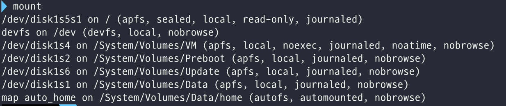
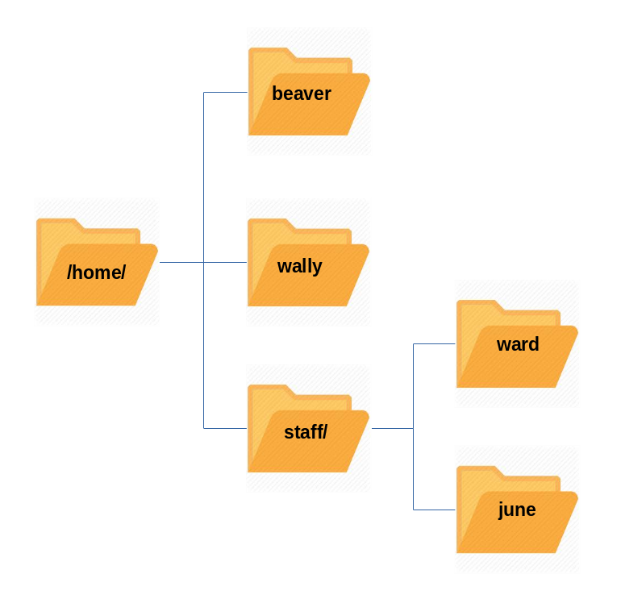
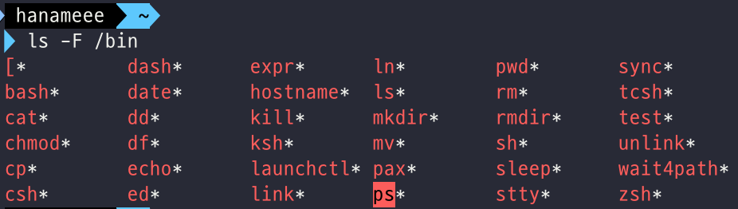
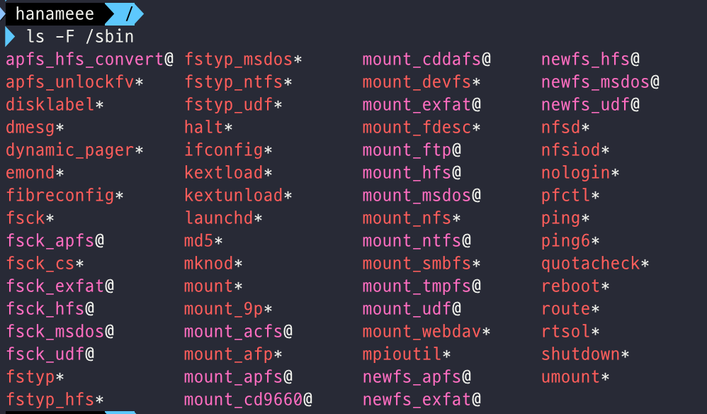
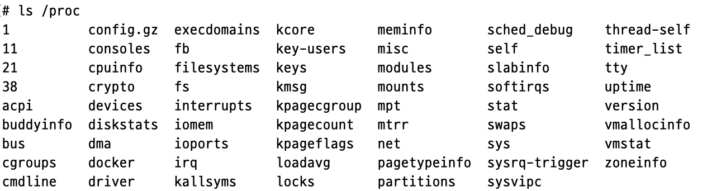
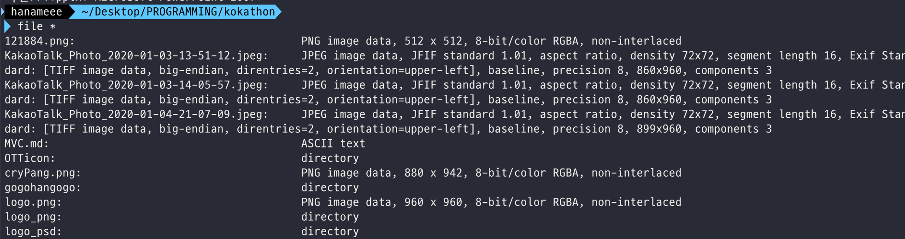

# Ch10 - File Operations

## Introduction and Learning Objectives

👩🏻‍🏫 **Learning Objectives**

- Explore the filesystem and its hierarchy.
- Explain the filesystem architecture.
- Compare files and identify different file types.
- Back up and compress data.

## Filesystems

### Introduction to Filesystems

리눅스에서는 모든 것이 파일이다. (혹은, 최소한 파일처럼 다뤄진다) 즉, 일반적인 데이터 파일이나, document를 다루던, 사운드카드/프린터 같은 디바이스를 다루던, 같은 I/O 연산으로 상호작용 한다.

Linux를 비롯한 많은 시스템들에서, 파일 시스템은 거꾸로 된 tree처럼 구성되어 있다. 파일 시스템의 가장 상위에 root directory가 있고, `/` 로 표시된다.


⚠️ root directory는 root user과 다르다.

### Filesystem Varieties

리눅스는 여러 native filesystem type을 지원한다.

- ext3
- ext4
- squashfs
- btrfs

또한, 타 OS에서 사용되는 파일 시스템의 implementation도 지원한다.

- Windows (ntfs, vfat)
- SGI (xfs)
- IBM (jfs)
- MacOS (hfs, hfs+)

FAT과 같은, 레거시 파일시스템 역시 지원한다.

많은 경우에, 머신에서 하나 이상의 파일시스템 타입이 사용된다.

### Linux Partitions

리눅스 시스템의 각 파일시스템은 disk partition을 점유한다. Partition은 포함하고 있는 데이터의 종류와 사용에 따라 디스크들의 내용을 정돈할 수 있게 해준다.

시스템을 실행하기 위해 필요한 주요 프로그램들이 담긴 `root 또는 /`, 일반 유저들이 가지고 있는 파일을 포함한 `/home` 은 각기 다른 partiton에 저장된다.

리눅스의 연산 과정에서 생성되고 사라지는 temporary file들도 별도의 지정된 partition에 위치한다.

이렇게 partition을 isolate하는 것의 장점은, 특정 파티션의 공간이 다 소진되도 전체 시스템이 정상적으로 동작한다는 것!

### Mount Points

파일시스템을 사용하기 전에, mount point에서 filesystem tree 위에 파일 시스템을 mount 해야한다.


mount point는 단순 디렉토리이고, 없으면 생성해야 한다.

### Mounting and Unmounting

**mount** 명령어는 파일시스템을 filesystem tree 내부 어딘가에 붙이기 위해 사용한다. 일반적인 arguments는 device node와 mount point이다.

```bash
sudo mount /dev/sda5 /home
```

예를 들어 위 명령어는  `/dev/sda5` device node와 연관된 디스크 파티션에 포함된 filesystem을, `/home` mount point의 filesystem tree에 attach 한다.

unmount 하려면 아래 명령어!

```bash
sudo umount /home # 주의! unmount가 아니라 umount임
```

아무 argument 없이 `mount` 명령어를 실행하면, 현재 mount 된 모든 파일시스템을 보여준다.



### NFS and Network Filesystems

NFS (Network FileSystem)는 공유된 원격 호스트의 파일을 로컬에서 사용할 수 있도록 개발된 파일 시스템이다. **NFS 서버**가 파일을 공유하면, **NFS 클라이언트**가 공유한 디렉토리를 마운트해서 원격 호스트 (NFS 서버)의 파일을 사용하는 것!


remote user의 home directory를 서버에 mount 해서, 유저들이 다른 컴퓨터에 로그인 하더라도 같은 파일과 리소스에 접근 가능하도록 하는 것이다.

### NFS on the Server

NFS는 서버 머신에서 daemon (built-in networking and service processes in Linux) 을 사용하고, 다른 시스템 서버들은 아래 명령어를 통해 시작된다.

```bash
$ sudo systemctl start nfs
```

`/etc/exports` 에 있는 텍스트 파일은 host가 NFS를 통해 공유하고 싶은 디렉토리들과 권한에 대한 정보를 담고 있다.

 예를 들면 아래 파일은

```
/projects *.example.com(rw)
```

- `/projects` 가 NFS를 통해 mount 될 수 있도록 허용한다.
- read&write 권한 (rw)을 허용한다.
  - 참고: Linux의 모든 파일은 3개의 권한을 가진다. read(r), write(w), execute(x)
- example.com 도메인의 다른 host 들과 공유된다.

`/etc/exports` 파일을 수정한 후, `exportfs -av` 명령어를 통해 Linux에 NFS를 사용해 원격으로 mount 를 허용하게 할 디렉토리를 허용할 수 있다.

```bash
sudo systemctl restart nfs
```

위 명령어를 통해 nfs를 재시작 할 수 있는데, 이 명령어는 NFS를 재시작하기 전에 잠시 정지시키므로 좀 무겁다.

마냑 시스템이 부팅될 때 NFS 서비스도 같이 시작되도록 하고 싶다면, 아래 명령어를 통해 설정 가능하다. (p.s. RHEL/CentOS8에서는 nfs가 아닌 nfs-server)

```bash
sudo systemctl enable nfs
```

### NFS on the Client

클라이언트 머신에서는 시스템이 부팅될 때 remote filesystem이 자동으로 mount 되는 것이 바람직하다. 이 작업을 해주는 것이 `etc/fstab` 이다. 요 파일의 예시는 아래와 같다.

```
servername:/projects /mnt/nfs/projects nfs defaults 0 0
```

만약 reboot 없이 remote filesystem을 mount 하고 싶거나, 일회성으로 mount 하고 싶다면 아래 `mount` 명령어로 바로 할 수 있다.

```bash
sudo mount servername:/projects /mnt/nfs/projects
```

만약 `/etc/fstab` 이 수정되지 않았다면 이 remote mount는 (일회용이기에) 다음에 시스템이 재시작되면 존재하지 않는다.

## Filesystems Architecture

Linux의 중요한 디렉토리들에 대해 알아보자! 'v'

### Overview of User Home Directories

각 유저는 (주로) `/home` 하위에 위치하는 home directory를 가지고 있다.



멀티 유저 시스템에서  `/home` 디렉토리는 주로 고유한 파티션을 가진 별개의 파일시스템으로 mount 되거나, NFS를 통해 네트워크에 원격으로 export 된다.

### The /bin and /sbin Directories

`/bin` 디렉토리는 주로 실행가능한 binaries, 시스템 부팅을 위해 사용되는 필수 명령어들, 모든 시스템 유저들에게 필요한 필수 명령어들 (e.g. cat, cp, ls, mv, ps, rm) 등을 포함한다.



`/sbin` 은 시스템 관리/운영을 위해 필요한 필수 바이너리들을 포함한다. (e.g. fsck, ip)



시스템 부팅이나 운영에 필수적이지 않은 명령어들은 `/usr/bin` 또는 `/usr/sbin` 에 포함되어 있다. 과거에는 이런 분리를 통해 `/usr` 이 별도의 파일시스템으로 분리되어 추후 시스템 startup 단계에 mount 되거나, 네트워크를 통해 mount 될 것을 기대했지만...! 최근에는 이런 분리를 통한 효용이 별로 없음이 (몇몇 배포판에서는 부팅이 불가능하다는 등) 밝혀지면서 요즘에는 그냥 `/usr/bin` 과 `/bin` 이 symbolic하게 링크되어 있는 경우가 많다. (`/sbin`도 마찬가지)

### The /proc Filesystem

`/proc` 는 process 파일 시스템이 마운트되는 곳이다. (축약해서는 procfs)

`/proc` 에 마운트 된 것과 같은 특정 파일시스템들은 **pseudo-filesystems** 라고 불린다. 왜냐면, 디스크 어디에서도 영구적으로 존재하지 않기 때문에!

`/proc` 파일시스템은 메모리에만 존재하는 virtual files를 포함한다. `/proc` 은 커널 구조와 설정 정보를 모방한 파일과 디렉토리를 포함할 뿐, 실제 파일을 포함하진 않는다. 대신 runtime 시스템 정보를 포함한다. (e.g. system memory, devices mounted, hardware config 등)



proc에서 중요한 몇몇 entries는 다음과 같다.

- /proc/cpuinfo 
- /proc/interrupts 
- /proc/meminfo 
- /proc/mounts 
- /proc/partitions 
- /proc/version

참고: https://superuser.com/questions/631693/where-is-the-proc-folder-on-mac-os-x

이 외에도 `/proc` 에는 아래와 같은 서브디렉토리들도 있다.

- /proc/<Process-ID-#> : 시스템에서 돌고 있는 모든 프로세스들은 이에 대한 vital information을 포함하는 디렉토리를 가지고 있다.
- /proc/sys : 전체 시스템에 대한 정보(하드웨어, config)를 가지고 있는 virtual directory

`/proc` 파일 시스템은 필요한 경우에만 사용되고, 디스크 용량을 필요로 하지 않으므로 유용하다.

### The /dev Directory

`/dev` 디렉토리는 대부분의 하드웨어/소프트웨어 장치에서 사용되는 psedo-file인 **device** nodes를 포함한다. (네트워크 디바이스 제외)

이 `/dev` 디렉토리는 아래와 같은 특징을 갖는다.

- mount 되지 않은 경우엔 disk partition에서 비어있다.
- (리눅스에서 device nodes를 관리하는) udev 시스템에 의해 생성된 entries를 포함한다. 이 시스템은 디바이스가 발견되면 동적으로 device nodes를 생성한다.

`/dev` 디렉토리에는

1. /dev/sda1 (first partition on the first hard disk)
2. /dev/lp1 (second printer)
3. /dev/random (a source of random numbers).

등이 포함되어 있다.

### The /var Directory

`/var` 디렉토리는 variable을 의미하는데, 시스템이 실행될때 용량과 내용이 바뀔 것으로 예상되는 file들을 포함한다. 예를 들면

- System log files: /var/log
- Packages and database files: /var/lib
- Print queues: /var/spool
- Temporary files: /var/tmp

`/var` 디렉토리는 갑자기 폭발적으로 파일 사이즈가 커져도 시스템에 영향을 미치지 않도록 별개의 파일시스템으로 설정될 수 있다. `/var/ftp` , `/var/www` 등의 네트워크 서비스 디렉토리들도 `/var` 내부에 포함된다.

### The /etc Directory

`/etc` 디렉토리는 **시스템 설정 파일**을 위한 공간이다. 

시스템이 DNS를 위한 host name을 얻기 위해 network 상에서 어떤 서버에게 물어봐야 하는지가 기술되어 있는 `etc/resolv.conf` 나, 유저 계정을 관리하기 위한 `passwd`, `shadow`, `group` 등의파일들도 `/etc` 하위에 위치한다.

⚠️ `/etc` 디렉토리는 시스템 전체적인 설정파일을 위한 공간이고, superuser만 파일 수정이 가능하다. 각 유저 설정파일은 유저의 홈 디렉토리 내부에서 확인할 수 있다. 

### The /boot Directory

`/boot` 디렉토리는 시스템을 부팅하기 위해 필요한 몇몇 필수 파일을들 포함한다.

1. vmlinuz
   The compressed Linux kernel, required for booting.
2. initramfs
   The initial ram filesystem, required for booting, sometimes called initrd, not initramfs.
3. config
   The kernel configuration file, only used for debugging and bookkeeping.
4. System.map
   Kernel symbol table, only used for debugging.

### The /lib and /lib64 Directories

`/lib`은 `/bin` 과 `/sbin` 에 있는 필수 프로그램들이 실행되기 위해 필요한 라이브러리 코드들이 포함되어 있다. 파일 이름은 대부분 `ld` 나 `lib` 으로 시작한다.

그리고 lib 내부 디렉토리는 `/bin` 과 유사하게 `/usr` 에 symlink 되어 있는 경우가 많다.

### Removable media: the /media, /run and /mnt Directories

USB, CD, DVD처럼 removable한 저장매체를 사용하기 위해서는 기존 파일시스템에 접근이 가능해야 한다. 기존에는 이런 removable media를 위한 mount point는 `/media` 디렉토리였으나, 최근의 리눅스 배포판들은 `/run`을 사용한다.

`mnt` 디렉토리도 일시적으로 파일시스템을 mount 하기 위해 사용되는데, removable media 외에도 network filesystem 등을 mount 하기도 한다.

### Additional Directories Under /:

root 디렉토리 하위에 있는 기타 디렉토리들은 아래와 같다.

| **Directory Name ** | **Usage**                                                    |
| ------------------- | ------------------------------------------------------------ |
| opt                 | Optional application software packages                       |
| sys                 | Virtual pseudo-filesystem giving information about the system and the hardware Can be used to alter system parameters and for debugging purposes |
| srv                 | Site-specific data served up by the system Seldom used       |
| tmp                 | Temporary files; on some distributions erased across a reboot and/or may actually be a ramdisk in memory |
| usr                 | Multi-user applications, utilities and data                  |

### The /usr Directory Tree

`/usr` 디렉토리에는 이론적으로 시스템 부팅을 위한 파일들이 포함되어 있지 않으므로, 상대적으로 덜 필수적인 프로그램과 스크립트가 포함되어 있다.

`/usr` 디렉토리 하위에 최소한으로 포함된 디렉토리는 아래와 같다.

| **Directory Name ** | **Usage**                                                    |
| ------------------- | ------------------------------------------------------------ |
| /usr/include        | Header files used to compile applications                    |
| /usr/lib            | Libraries for programs in /usr/bin\ and /usr/sbin            |
| /usr/lib64          | 64-bit libraries for 64-bit programs in /usr/bin\ and /usr/sbin |
| /usr/sbin           | Non-essential system binaries, such as system daemons        |
| /usr/share          | Shared data used by applications, generally architecture-independent |
| /usr/src            | Source code, usually for the Linux kernel                    |
| /usr/local          | Data and programs specific to the local machine. Subdirectories include bin, sbin, lib, share, include, etc. |
| /usr/bin            | This is the primary directory of executable commands on the system |

## Comparing Files and File Types

### Comparing Files with diff

파일과 디렉토리를 관리하는 법에 대해 알아보자.

`diff` 는 파일들과 디렉토리를 비교하기 위해 사용되고, 아래와 같이 여러 유용한 옵션들을 가지고 있다.

| **diff Option** | **Usage**                                                    |
| --------------- | ------------------------------------------------------------ |
| -c              | Provides a listing of differences that include three lines of context before and after the lines differing in content |
| -r              | Used to recursively compare subdirectories, as well as the current directory |
| -i              | Ignore the case of letters                                   |
| -w              | Ignore differences in spaces and tabs (white space)          |
| -q              | Be quiet: only report if files are different without listing the differences |

아래 명령어로 2개의 파일을 비교할 수 있다.

```bash
diff [options] <filename1> <filename2>
```

p.s. binary 파일 비교를 위해서는 `cmp` 를 사용한다.

### Using diff3 and patch

`diff3` 을 통해 3개의 파일을 한꺼번에 비교할 수 있다. 하나의 파일을 reference로 삼아 나머지 2개를 비교하는 것!


`patch`는 파일의 older version을 new version으로 업데이트하기 위해 요구되는 변화를 distribute 한다.  변화값을 가지고 patch 파일을 만드는 것. patch는 아주 자주 사용되는 유틸리티다.

사실 patch는 내부적으로 diff에 옵션을 붙여 실행된다. `diff -Nur originalfile newfile > patchfile`

### Using the file Utility

리눅스에서는 윈도우와는 다르게 파일 확장자가 100% 그 파일이 무엇인지를 나타내지 않는다. 예를 들어 `file.txt` 인 파일이 사실은 텍스트 파일이 아니고 실행 파일일 수도 있는 것!

파일 확장자는 보통 시스템보단 유저에게 의미가 있다.

시스템이나 애플리케이션은 파일이 실제로 무엇인지를 알아내기 위해 (확장자로 판단하는 대신) 파일의 컨텐츠를 검사한다. 파일의 real nature을 판단할 수 있는 유틸리티가 바로 `file` 유틸리티!

file 명령어를 사용하면 파일의 내용을 검사해, 해당 파일이 text인지, shared lib인지, 실행파일인지, script인지...등등을 판단할 수 있다.



## Backing Up and Compressing Data

### Backing Up Data

데이터나 시스템을 백업하는 방법은 여러가지가 있는데, 기본적으로는 단순 복사인 `cp` 와, 좀 더 robust한 명령어인 `rsync`가 있다.

모든 디렉토리 트리를 동기화한다고 생각했을 때, `rsync`가 `cp` 보다 좀 더 효과적인 이유는 다음과 같다.

- 복사하는 파일이 이미 존재하는지 확인한다. 이미 존재한다면 rsync는 불필요한 파일 복사를 하지 않는다.
- 파일에서 실제로 변경된 부분만을 복사하므로 빠르다.
- 로컬 (혹은 NFS로 mount된 파일시스템) 머신 내에서만 복사가 가능한 cp와는 달리, rsync는 서로 다른 머신 간에도 파일을 복사할 수 있다.

### Using rsync

rsync는 강력하지만 파괴적인 명령어이기에, 처음 `rsync` 명령어를 사용할 때는 `-dry-run` 옵션을 통해 실행해보는 것이 추천된다.

```bash
$ rsync -r project-X archive-machine:archives/project-X
```

위와 같은 명령어로 백업이 가능하다.

### Compressing Data

리눅스가 파일 압축을 위해 사용하는 방법들은 아래와 같다.

| **Command** | **Usage**                                                    |
| ----------- | ------------------------------------------------------------ |
| gzip        | The most frequently used Linux compression utility           |
| bzip2       | Produces files significantly smaller than those produced by **gzip** |
| xz          | The most space-efficient compression utility used in Linux   |
| zip         | Is often required to examine and decompress archives from other operating systems |

 각 압축 테크닉은 그 효율성과, 걸리는 시간에 있어 차이가 있고 일반적으로 효율적일수록 (더 많은 공간이 절약될 수록) 압축이 오래 걸린다.

추가적으로 저장소 내의 파일을 그룹짓고 한꺼번에 압축하기 위해 주로 `tar` 유틸리티가 사용된다. `tar` 로 압축을 해제할 수도 있고, 압축 파일을 만들 수도 있다.

### Disk-to-Disk Copying (dd)

`dd` 프로그램은 raw disk space의 사본을 만들때 아주 유용하게 사용된다.

```bash
# 주의! 첫번째 디스크가 두번째 디스크로 복사되어, 두번째 디스크의 모든 내용이 삭제된다!
dd if=/dev/sda of=/dev/sdb
```


