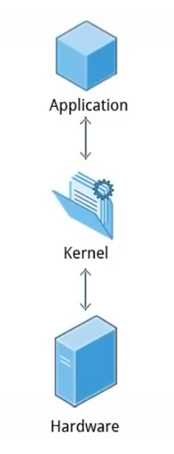
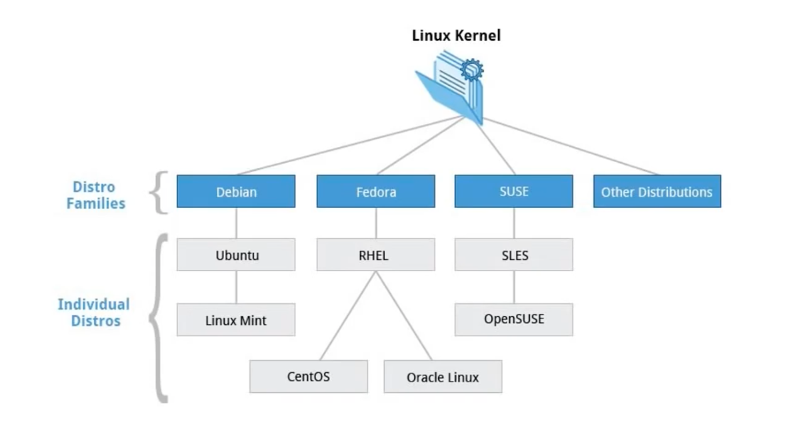
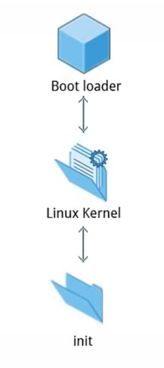
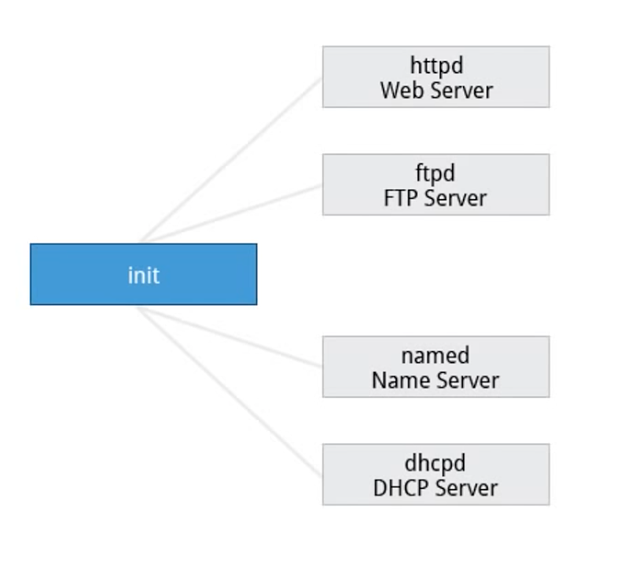
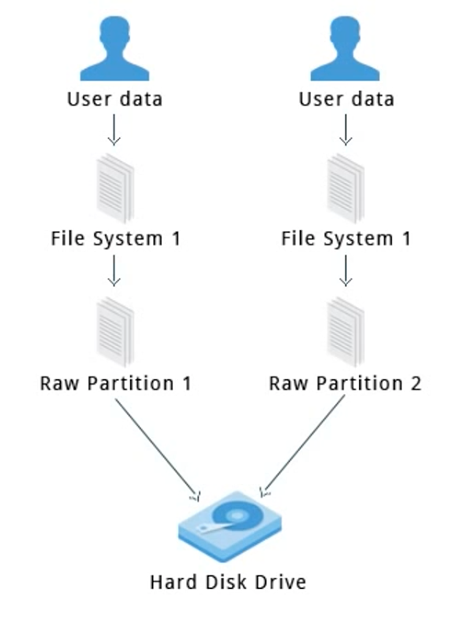
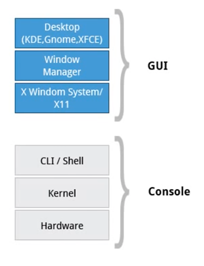
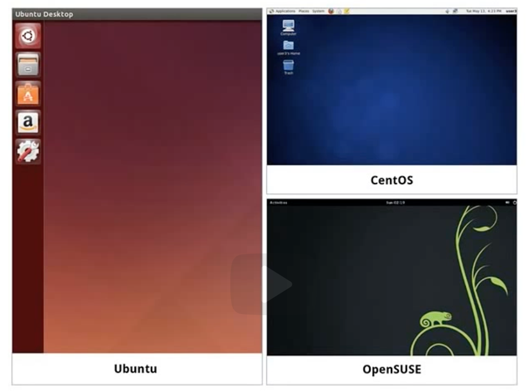
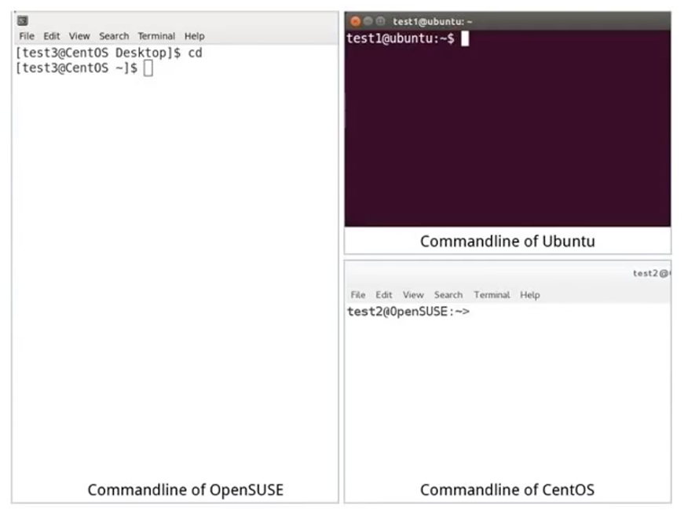
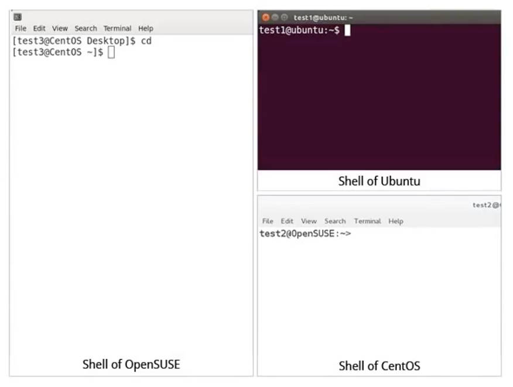
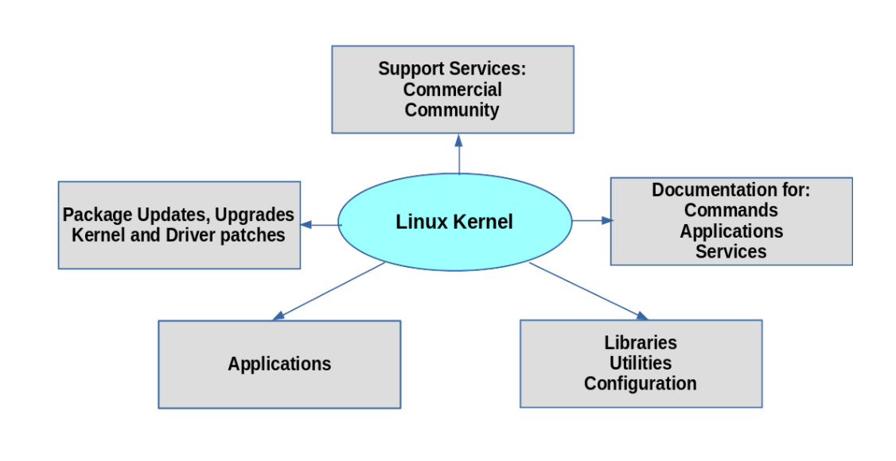

# Ch2 - Linux Philosophy and Concepts

## Introduction and Learning Objectives      

Linux is an **operating system** and its core is just a **kernel**. It talks to the hardware and makes the hardware work.

👩🏻‍🏫 **Learning Objectives**

- Discuss the history and philosophy of Linux.
- Describe the Linux community.
- Define the common terms associated with Linux.
- Discuss the components of a Linux distribution.

## Linux History 

1990년대 초반에 리누스 토발즈에 의해 처음 개발되고, 이후 90년대 중반에 Linux distributions 가 개발되면서 fully free computing과 open source software development의 초석을 다졌다.

현재 Linux는 인터넷에서 절반 이상의 서버에 사용되고, 수많은 핸드폰에서 사용되는 안드로이드 시스템 역시 Linux 위에서 개발되었다.

## Linux Philosophy

리눅스는 UNIX 운영체제에서 많은 부분을 빌려왔다. UNIX로부터 inspired 되었지만, UNIX는 아닌 그런 관계.

리눅스의 컴포넌트들은 파일들(이나 파일처럼 보이는 객체들)을 통해 사용 가능하다. 프로세스, 디바이스, 네트워크 소켓들 모두가 일반 파일과 다름 없이 표현되고, 일반 파일에 사용하는 유틸리티들을 가지고 다룰 수 있다.

또, 리눅스에서는 UNIX에서 daemon이라고 불리는 빌트인 네트워킹/서비스 프로세스들을 통해 멀티태스킹(동시적으로 수행되는 다수의 실행 스레드), 멀티 유저 운영체제등이 가능하다. 

리눅스는 worlds largest collaborative development project in history of computing이다. 경쟁 운영체제들과 비교해봤을 때, 리눅스가 가진 특유의 collaborative 개발 프로세스 덕분에 리눅스는 아주 빠른 발전과 독보적인 점유율을 가질 수 있게 되었다.

## Linux Community

리누스 토발즈가 처음 리눅스 커널을 만들 때 GPL 라이센스를 채택했는데, 이 덕분에 리눅스 커널과 다른 gnu components가 컴퓨터 산업을 크게 발전시켰다.

다양한 리눅스 커뮤니티들이 있고, 가장 강력한 유저 커뮤니티 중 하나는 The Linux Foundation의 [linux.com](https://www.linux.com/) 이다.

## Linux Terminology

리눅스를 본격적으로 공부하기 전에 Linux community에서 흔하게 사용되는 용어들에 대해 알아보자.

**Kernel**: Glue between hardware and applications. 리눅스 운영체제의 브레인 역할을 한다. 하드웨어를 컨트롤하고, 하드웨어가 어플리케이션과 interact 하도록 한다.

**distribution** (Distros): Collection programs combined with the Linux kernel to make up a Linux-based operating system. (Ex. Red Hat Enterprise Linux, Fedora, Ubuntu...)

**boot loader**: Program that boots the operating system. (Ex. GRUB, ISOLINUX)

**service**: Program that runs as a background process. (Ex. Https, nfsd, ntpd, fitted, named)

**Filesystem**: Method for storing and organizing files. (Ex. ext3, ext4, FAT, XFS, Btrfs)

**X Window System**: Provides the standard toolkit and protocol to build graphical user interfaces on nearly all Linux systems.

**Desktop Environment**: Graphical user interfaces on top of the OS. (Ex. GNOME, KDE, Xfce, Fluxbox)

**Command Line**: Interface for typing commands on top of OS.

**Shell**: The command line interpreter that interprets the command line input and instructs the OS to perform any necessary tasks and commands. (ex. bash, tcsh, zsh)

쉘이 command line을 통해 컴퓨터와 interact 할 수 있게 해주는 소프트웨어다.

## Linux Distributions

Linux Distributions 들은 OS의 핵심인 Linux Kernal에 더해 다른 소프트웨어 도구들(파일 관련 기능, 유저 관리, 소프트웨어 패키지 관리 등)을 포함하고 있다. 

Linux Distributions들은 리눅스 커널에 기반해 만들어진다. Linux Distributions들은 stable 한 커널 버전에 기반하기도 하고, 새로운 리눅스 커널이 릴리즈 될 때 이를 반영하기도 한다.

Distributions은 아래의 것들을 포함한다.

- C/C++ compiler
- the gdb debugger
- the core system libraries applications need to link with in order to run
- the low-level interface for drawing graphics on the screen
- higher-level desktop environment
- system for installing and updating the various components (including the kernel itself)

이처럼 핵심적인 리눅스 커널 외의 여러 소프트웨어 도구들을 포함한 것이 Linux Distribution이다.

[Linux Distribution의 기능]

다양한 Linux Distributions들은 여러 다른 기관, 조직의 요구와 취향에 맞게 디자인되어있기도 하고, 기업이나 정부기관이 주로 이용하는 상업적으로 대중화된 Distribution들도 있다. Red Hat, SUSE, Canonical(Ubuntu)가 그러하다.

Cent OS는 RHEL의 무료 대체 버전으로 인기가 많아서 유료 기술 지원이 필요 없는 조직에서 많이 사용한다.

Ubuntu와 Fedora는 개발자나 교육 분야에서 많이 사용한다.

Scientific Linux는 scientific, mathematical software packages와의 높은 호환성 덕에 과학 기술 분야에서 많이 사용된다.

Red Hat, Ubuntu, SUSE, Oracle 같은 상업 distributors는 그들의 배포판을 위한 지원을 제공한다. 최신 보안, 버그 수정, 성능 향상 등을 반영하는 업데이트를 하고, 온라인으로 기술 지원을 제공해주기도 한다.

## Summary

- Linux borrows heavily from the UNIX operating system.
- Linux accesses many features and services through files and file-like objects.
- Linux is a fully multi-tasking, multi-user operating system, with built-in networking and service processes known as daemons.
- A full Linux distribution consists of the kernel plus a number of other software tools for file-related operations, user management, and software package management.