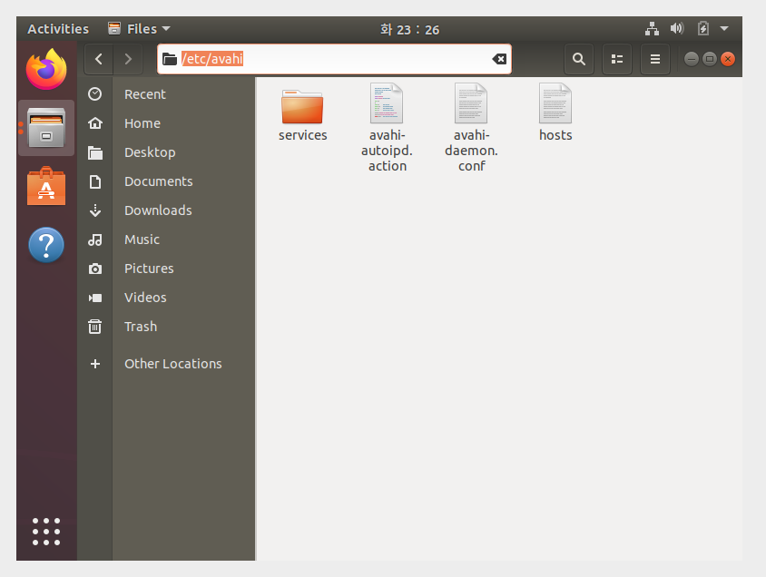
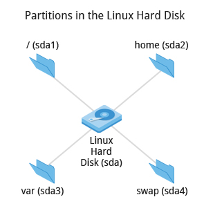

# Ch3 - Linux Basics and System Startup

## Introduction and Learning Objectives

Linux boot process에 대해 논의 할 것임. Boot loader부터 GUI까지. Linux 설치 과정도 다룰 것.

👩🏻‍🏫 **Learning Objectives**


- Identify Linux filesystems.
- Identify the differences between partitions and filesystems.
- Describe the boot process.
- Install Linux on a computer.

## ⚡️ The Boot Process

리눅스의 부트 프로세스는 시스템을 초기화하기 위한 절차이다. 컴퓨터 전원이 처음 켜졌을 때부터, 유저 인터페이스가 완전히 작동하기까지 일어나는 모든 것을 포함한다.


### BIOS (Basic Input Output System)

x86(인텔 32비트 이하 계열 제품명)-based Linux system을 시작하기 위해선 여러 단계가 필요하다.

먼저, 컴퓨터 전원이 켜지면 BIOS가 하드웨어(스크린, 키보드)를 초기화하고, 메인 메모리를 테스트한다. 이 과정은 POST (Power On Self Test) 라고도 불린다.


BIOS 소프트웨어는 메인보드(마더보드)의 ROM 칩에 저장되어 있다.

이 BIOS 과정 이후의 부트 프로세스는 OS에 의해 컨트롤된다.

### MBR(Master Boot Record ) and Boot Loader

POST가 끝나면 시스템 컨트롤은 BIOS에서 boot loader로 이동한다.

boot loader은 주로 하드디스크의 (전통적인 BIOS/MBR system의 경우에는) boot sector이나 (최근의 EFI/UEFI system의 경우에는) EFI 파티션에 위치한다.

이 단계까지 머신은 mass storage media에 접근하지 않기에, 시간, 날짜, 주변 기기에 대한 정보는 CMOS 값으로부터 로드된다.

Linux에는 여러 boot loader들이 존재하는데, 가장 흔한 것들은 GRUB (GRand Unified Boot loader), ISOLINUX, DAS U-Boot 등이다.

Linux를 부팅할 때, 이 boot loader가 커널 이미지와 초기 RAM disk 또는 (시스템을 시작하기 위해 필수적인 파일들과 장치 드라이버들을 포함하는) 파일 시스템을 메모리(RAM)에 로드한다.


[참고] 

[CMOS와 BIOS의 차이를 아는가?](http://forensic-proof.com/archives/181)

[[OS X의 기초상식] EFI란 무엇인가?](https://m.blog.naver.com/PostView.nhn?blogId=minkever&logNo=130085717297&proxyReferer=https:%2F%2Fwww.google.com%2F)

### Boot Loader in Action


Boot loader에는 크게 2가지 단계가 있다.

[1단계]

- BIOS/MBR 메소드를 이용하는 시스템의 경우, boot loader이 하드디스크의 첫번째 섹터 - Master Boot Record (MBR)에 위치한다. 이 단계에서 boot loader은 partition table을 검사해 bootable partition을 찾아낸다. 찾은 후에는 second stage boot loader (ex.GRUB)을 찾아 RAM에 로드한다.
- EFI/UEFI 메소드를 이용하는 시스템의 경우, UEFI 펌웨어가 Boot Manager 데이터를 읽어서 어떤 UEFI 앱이 어디서 런칭되어야 하는지에 대한 정보를 얻는다. 이후 펌웨어는 펌웨어의 Boot Manager에의 boot entry에 정의된 대로 UEFI 앱(ex.GRUB)을 launch한다. 이 방법은 예전 MBR 메소드보다 좀 더 복 잡하지만 더 융통성있다. (versatile)

[2단계]

2단계에서 boot loader은 `/boot` 에 위치한다. 이때 유저에게 어떤 OS로 부팅할건지 선택하게 하는 화면이 뜬다.

OS 선택 후에는 boot loader이 선택된 OS의 커널을 RAM에 로드하고, control을 해당 커널로 넘긴다. 보통 커널은 항상 compressed 되어있기에, 보통 가장 처음 스스로를 uncompress한다. 이후에는 시스템 하드웨어를 체크/분석하고, 커널로 빌드된 하드웨어 기기 드라이버를 초기화한다.

### Initial RAM Disk


**initramfs** 파일시스템 이미지에 올바른 root 파일 시스템을 마운트하기 위한 모든 액션들을 수행하는 프로그램/바이너리 파일이 들어있다. 예를 들어, 아래와 같은 액션들

- 필요한 파일시스템, mass storage controllers를 위한 디바이스 드라이버 (현재 어떤 장치들이 있는지 파악하기 위해 쓰이는 udev facility와 함께)를 위한 커널 기능 제공 (이게 대체 무슨 소리람...)

> The **initramfs** filesystem image contains programs and binary files that perform all actions needed to mount the proper root filesystem, like providing kernel functionality for the needed filesystem and device drivers for mass storage controllers with a facility called **udev** (for **u**ser **dev**ice), which is responsible for figuring out which devices are present

- 제대로 작동하기 위해 필요한 디바이스 드라이버들을 위치시키고, 로드하는 것

filesystem이 발견된 후에는 에러 체크를 한 후 마운트된다.

**Mount** 프로그램은 OS에게 파일시스템이 사용 가능하다고 안내하고, mount point와 파일시스템을 연동한다. 이 과정이 성공적이라면 initramfs는 RAM에서 제거되고, root fs(`/sbin/init`)의 init 프로그램이 실행된다.

**init**은 실제 최종 root filesystem으로의 mounting, pivoting을 담당한다. 만약 특정 하드웨어 드라이버가 mass storage가 접근 가능해지기 전에 필요하다면, 그 드라이버는 initramfs 이미지 안에 있어야 한다.

### Text-Mode Login


**init**은 여러 text-mode login 시도들을 실행한다. 이 시도들은 유저가 username, password를 입력하게 한 후 command shell을 겟또하게 한다. 만약 graphical login interface를 사용하는 시스템을 쓰고 있다면 요런 text-mode login은 보이지 않는다.

주로 기본값 command shell은 **bash**(GNU Bourne Again Shell)다. 하지만 더 발전된 command shell도 많다!

Shell은 명령어를 받아들일 준비가 되었다는 의미로 text prompt를 출력한다. 유저가 커맨드를 치고 엔터를 누르면 커맨드가 실행되고, 커맨드가 끝난 후에는 다른 propmt가 출력된다.

## Kernel, init and Services


### The Linux Kernel

boot loader은 커널과, 초기 RAM-based 파일시스템 (initramfs)을 메모리에 로드해서 커널이 바로 사용할 수 있게 한다.

커널이 RAM에 로드된 직후, 커널은 컴퓨터의 메모리를 초기화하고 configure한다. 그 외에도 시스템에 부착된 하드웨어(processor, I/O subsystem, 저장 장치 등등...)도 configure한다. 커널은 또한 필요한 몇몇 user space application도 로드한다.

### /sbin/init and Services

커널이 하드웨어를 모두 준비하고, root filesystem을 마운트 한 뒤에는 `/sbin/init` 을 실행한다. 이 `/sbin/init`이 시스템 실행을 위한 다른 프로세스들을 시작하는 첫 프로세스가 된다. (커널 프로세스를 제외하고) 시스템에 있는 대부분의 프로세스의 근원(?)을 따라가보면 init임을 알 수 있다.

init은 시스템을 시작하는 것 외에도, 시스템이 잘 동작하도록 유지하고, 명확하게 shut down 하는 역할도 한다. 또한, non-kernel 프로세스들의 매니저 역할도 하는데, 해당 프로세스들이 완료되었을때 cleanup하거나, 유저가 로그인/로그아웃 했을 때 로그인 서비스를 재시작 하거나, 백그라운드 시스템 서비스도 마찬가지로 cleanup 해주는 역할 등을 한다.

전통적으로 이런 process startup은 1980년대에 System V라는 관행을 사용해 이뤄졌다. System V는 serial process로써, 서비스를 시작하고 멈추는 스크립트들의 collection을 포함하는 sequence of runlevels를 시스템이 통과하게 하는 식으로 이루어졌다.

하지만, 최근 linux의 major distributions들은 이런 System V와 같이 sequential runlevel method of system initialization이 아닌 더 최신화된 방법을 사용한다. 다음 챕터에 이 newer methods인 **systemd** and **Upstart**에 대해 알아볼 것.

### Startup Alternatives

SysVinit은 stage들의 진행을 연속적인 과정으로 보았고, 연속적인 단계들의 시리즈로 나눴다. 각각의 단계들은 다음 단계가 수행되기 전, 이전 단계가 완료되어야 했다. 따라서, startup에서 멀티 프로세서/코어의 병렬처리(parallel processing) 이점을 누릴 수가 없었다.

더욱이 예전에는 shutdown과 reboot이 상대적으로 드문 이벤트여서 오래 걸리든 말든 크게 중요하지 않았지만, 최근에 모바일 디바이스와 embedded linux system에서나, 컨테이너와 같이 순간적으로 startup이 이뤄져야 하는 경우에는 더 이상 그렇지도 않게 되었다. 따러서 최근 시스템은 더 빠르고 향샹된 능력을 요한다.

마지막으로, 예전의 method들은 복잡한 startup 스크립트가 필요해서 많은 distribution version, kernel version, 아키텍처, 시스템 타입 등에서 동일하게 유지하기가 힘들었다.

요런 단점들 때문에 2가지 대안이 나왔다. 대표적인 2 Startup Alternatives는 아래와 같다.

- Upstart
- systemd

예전의 System V 방법이나 Upstart는 사실상 사장된 방법이고, 최근의 major distribution들은 거의 다 systemd를 적용했다. systemd 도입에 대해선 약간의 반론이 있을 수 있으나 - 그래도 훨씬 심플하다는 명확한 장점이 있기에 systemd에 대해 배울 것.

### systemd Features

systemd를 도입한 시스템들은 예전의 init 메소드를 사용하는 시스템들보다 더 빠르게 start up 한다. systemd는 기존의 init 메소드가 사용하던 연속적인 단계들을 공격적인 병렬 테크닉으로 대체한 덕분에 , 여러 서비스들이 동시다발적으로 초기화될 수 있기 때문이다.

복잡한 startup 쉘 스크립트들은 더 간단한 configuration files로 대체되었다. 이 config 파일들은 서비스가 시작되기 전에 어떤 것들이 완료되어야 하는지, startup이 끝났을 때 어떤 조건들이 만족되어야 하는 지에 대해 설명되어 있는 파일이다.

예전의 `/sbin/init` 은 이제 그냥 `lib/systemd/systemd`를 가르킨다. 즉, systemd가 그냥 init 프로세스를 이어받는 것!

한가지 systemd 커맨드가 대부분의 기초 작업에 사용된다. 바로 `systemctl`!! 예시 명령어는 아래와 같다.

> 현재 시스템에서 서비스 (ex.nfs) 시작/정지/재시작 하기

```bash
sudo systemctl start|stop|restart nfs.service
```

> system boot에서 서비스의 시작을 허용/비허용하기

```bash
sudo systemctl enable|disable nfs.service
```

대부분의 경우 `.service` 을 생략해도 된다.

## Linux Filesystems Basics

### Linux Filesystems 

파일시스템은 임의의 data의 collection들을 사람이 이용할 수 있는 형태로 보관하고 정리하는 냉장고와도 유사하다. 냉장고에 물건들을 크기, 종류, 모양 별로 분리해놓듯이.

Linux가 지원하는 파일시스템의 종류는 다음과 같다.

- Conventional disk filesystems: ext2, ext3, ext4, XFS, Btrfs, JFS, NTFS, etc. 
- Flash storage filesystems: ubifs, JFFS2, YAFFS, etc. 
- Database filesystems 
- Special purpose filesystems: procfs, sysfs, tmpfs, squashfs, debugfs, etc.

### Partitions and Filesystems

**Partition**이란? 디스크에서 물리적으로 인접한 디스크의 섹션이다.

**Filesystem**이란? 하드 디스크(주로 partition)에서 파일을 저장하고/찾는 방법이다.

파티션은 파일시스템을 담은 용기와 유사한 개념이다. 단, 몇몇 경우, symbolic link를 사용할 경우 파일 시스템은 파티션을 넘어 확장될 수도 있다.

[윈도우와 리눅스의 파일시스템 비교]

|                                  | **Windows** | **Linux**              |
| -------------------------------- | ----------- | ---------------------- |
| Partition                        | Disk1       | **/dev/sda1**          |
| Filesystem Type                  | NTFS/VFAT   | EXT3/EXT4/XFS/BTRFS... |
| Mounting Parameters              | DriveLetter | MountPoint             |
| Base Folder (where OS is stored) | C:\         | /                      |

### The Filesystem Hierarchy Standard

리눅스는 Filesystem Hierarchy Standard (FHS) 라는 표준 레이아웃에 따라 중요한 파일들을 저장한다. 이런 표준을 두는 이유는, 사용자들이 매번 새롭게 배우지 않으면서도 다양한 Linux distribution들을 사용할 수 있게끔 하기 위해서이다.

리눅스는 path 구분을 위해 `/` 기호를 사용하고, 별도의 drive letters가 없다. 여러 drivers나 partition은 단일 파일시스템의 directory로 마운트된다. CD,DVD,USB처럼 제거가능한 미디어는 최근 리눅스에서는 `/run/media/{username}/{disklabel}` 으로, 예전 리눅스 배포판에서는 `/media` 로 마운트된다.


### More About the Filesystem Hierarchy Standard

모든 리눅스 파일시스템은 case-sensitive 하다. (`/boot`, `/Boot`, `/BOOT` 는 다 각기 다른 디렉토리임)

많은 배포판은 (1) 올바른 시스템 작동을 위한 코어 유틸리티와 (2) 타 프로그램 을 구분한다. 후자는 주로 `/usr` 디렉토리 하위에 보관된다. 

### Video: Viewing the Filesystem Hierarchy from the Graphical Interface in Ubuntu

우분투에서 전체 디렉토리를 확인하려면 아래 사진에서는 Other Locations > Computer 로 들어가면 root directory부터 볼 수 있다.



현재 Path를 보려면 `ctrl+L` 을 누르면 됨.

## Linux Distribution Installation

### Choosing a Linux Distribution

어떤 Linux 배포판을 사용할 것인가?_?

전부 다는 아니지만 아래와 같은 선택지가 있다.


### Questions to Ask When Choosing a Distribution

배포판을 고를 때 생각해보면 좋은 질문들

- 주로 어떤 용도로 시스템을 사용할 것인지? (서버/데스크탑)
- 조직에게 중요한 package가 어떤 종류인지? (웹서버/word processing...)
- 얼마나 많은 하드디스크 용량이 필요하고/얼마나 여유가 있는지 (ex. Embedded 디바이스에 리눅스를 설치할 때는 보통 용량이 제한적이다)
- packages가 얼마나 자주 업데이트 되는지?
- 각 릴리즈 간의 support cycle이 얼마나 긴지? (ex. LTS releases들이 장기 서포트를 지원한다)
- 제 3자/벤더로부터 커널 customization이 필요한지?
- 어떤 하드웨어로 돌리는지? X86, ARM 등..
- 장기 안정성이 필요한지? 혹은 최신 소프트웨어를 지원하는 변화가 빠른 cutting-edge 시스템이라도 수용 가능한지?

### Linux Installation: Planning

**Partition 레이아웃**은 설치하는 시점에 정해져야 한다. 설치 후에는 변경하기 힘들 수 있다...!

리눅스 시스템은 여러 partition을 파일시스템의 특정 포인트에 mount 해서 관리하고, 내가 직접 디자인을 바꿀 수도 있다! 하지만 처음에는 항상 보고 따라하는게 쉬우니까, 모범 사례에 대해 알아BOZA.

대부분의 installers는 쓸만한 default 레이아웃들을 제공한다.

- 하나의 big partition에 일반 파일들을 할당, 작은 swap partition
- /home, /var 처럼 space-sensitive한 공간에 각기 다른 partition을 할당

등등...



[참고] 리눅스 SWAP 파티션이 하는 일: https://sergeswin.com/1034/

### Linux Installation: Software Choices

모든 installation은 리눅스 배포판을 사용하기 위한 bare mininum software을 제공하고, 몇몇 installer들은 추가적인 소프트웨어 설치 옵션을 제공하기도 한다. 대표적으로 Firefox 웹 브라우저나, LibreOffice office suite, vi나 emacs 같은 developer tools, 그리고 기타 인기 많은 서비스들 (아파치 웹서버나 MySQL...) 등의 프로그램들이 있다. 추가로, graphical desktop을 포함한 시스템은 기본적으로 chosen desktop (ex. GNOME, KDE) 이 깔려있다.

모든 installers는 새로운 시스쳄에 초기 보안 기능을 설정한다. 가장 기본적인 단계는 superuser (root) 를 위한 비밀번호를 설정하고, initial user을 설정하는 것이다.

몇몇 배포판의 경우 (ex. Ubuntu) 처음에는 오로지 initial user만 설정되고, direct root login은 설정되어있지 않다. Root access를 위해서는 처음에 일단 normal user로 로그인 한 뒤, **sudo**를 사용해야 한다.

###  Linux Installation: Install Source

다른 OS처럼, 리눅스 배포판도 CD, USB, DVD같이 제거가능한 media로 제공된다. 처음 booting은 small image로 하고, 나머지 시스템은 네트워크로 다운받을 수 있게도 지원한다.

많은 installer들은 설치 옵션들이 정의된 configuration file을 사용해서 설치 과정이 완전히 자동으로 이뤄질 수 있게 지원한다. 이 파일은 Red Hat-based 시스템에서는 `Kickstart` 로, SUSE-based 시스템에서는 `AutoYAST` 로, Debian-based 시스템에서는 `Preseed` 로 불린다.

각 배포판들은 이런 config 파일을 어떻게 생성하고 관리할지에 대한 설명과 툴들을 지원한다!

### Linux Installation: The Process

설치 과정은 배포판들이 다 비슷비슷함.

Installation media로부터 부팅을 하고 나면, installer이 시작한다.

installer은 시스템이 어떻게 설정되어야 할지에 대한 질문을 하고, (Auto installation 파일이 제공되면 이런 질문들은 스킵됨) 설치가 수행된다.

마지막으로, 컴퓨터는 새롭게 설치된 시스템으로 재부팅된다! (이때, 몇몇 배포판에서는 재부팅 후 추가적인 질문이 있을 수도 있다)

대부분의 installer들은 설치 과정 중 인터넷 접근을 통해 업데이트를 다운로드 및 설치하는 옵션이 있다. (이때 안해도 일반적으로 업데이트 하는 것처럼 나중에 설치 다 되고 난 후에 해도 됨)

