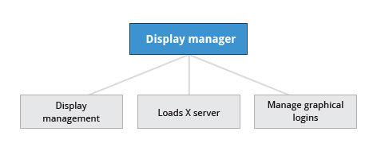

# Ch4 - Graphical Interface

## Introduction and Learning Objectives

👩🏻‍🏫 **Learning Objectives**

- Manage graphical interface sessions.

- Perform basic operations using the graphical interface.
- Change the graphical desktop to suit your needs.

## Graphical Desktop

Linux를 사용할 때 CLI (Command Line Interface)나 GUI(Graphical User Interface)를 사용할 수 있다.

반복적인 작업에는 CLI가 효율적인 반면, 자주 수행하지 않거나 디테일을 기억하기 힘든 작업은 GUI가 쉽다.

### X Window System

리눅스 데스크톱 시스템에서 **X Window System** (이하 X)이 부팅 프로세스의 마지막 단계로 로딩된다. **Display Manager**이라는 서비스가 제공되는 디스플레이들을 관리하고, X server을 로드하고, graphical login을 관리한다.

데스크톱 환경은 session manager, window manager, 그리고 set of utilities로 이뤄진다.

- session manager: graphical session의 구성 요소들을 시작하고 관리
- window manager: 창의 위치와 이동을 관리, 창의 title-bars와 controls 관리

default run level에서 display manager이 시작하지 않는다면, 콘솔에서 직접 `startx` 를 쳐서 graphical desktop을 시작할 수 있다. 혹은 수동으로 display manager(gdm, lightdm, kdm, xdm, etc.)을 CLI로 시작할 수도 있다.

### GUI Startup

desktop 환경을 설치하면, X display manager이 부팅 프로세스의 마지막에 시작한다. X display manager은 graphics system을 시작하고, 유저를 로그인시키고, 유저의 데스크톱 환경을 시작하는 역할을 한다.

데스크톱 환경에서 로그아웃 하면, 현재 X session에 있는 모든 프로세스가 kill되고 display manager login screen으로 돌아간다.

GNOME의 기본 display manager은 gdm이며, gdm 외에도 lighted, kdm 등이 인기있는 display manager이다.

### GNOME Desktop Environment

GNOME은 사용성 좋은 GUI를 포함한 인기있는 데스크톱 환경이고, 대부분의 리눅스 배포판의 default desktop enviroment로 포함되어 있다. 

KDE 역시 널리 사용되는 desktop environment이다.

### gnome-tweak-tool

Gnome-tweak-tool이라는 표준 유틸리티를 사용해서 theme이나 setting options를 변경할 수 있고, 외부 확장 프로그램도 쉽게 설치해서 관리할 수 있다.

## Basic Operations

### Home Directories

리눅스 시스템에서는 logged-in 세션들 간에 유저를 switch 할 수 있다.

파일 매니저를 통해 컴퓨터와/네트워크 상의 여러 장소에 접근할 수 있다.

시스템에 계정을 가진 각 유저는 **home** 디렉토리를 가진다. home 디렉토리는 주로 `/home` 아래에 생성되고, `home/hanameee` 처럼 유저 이름을 가진다.

유저가 저장하는 파일은 기본적으로 해당 위치 (ex. `home/hanameee`)부터 시작해서 저장된다. 또, `Documents`, `Desktop`, `Downloads` 와 같은 기본 디렉토리들도 함께 생성된다.

Command line에서 파일 매니저를 실행하려면 대부분의 시스템에서는 `nautilus` 를 입력하면 되고, `ctrl-L` 을 누르면 현재 디렉토리의 위치(location)를 확인할 수 있다.

### Removing a File

파일을 삭제하면 Nautilus는 자동으로 삭제된 파일들을 `.local/share/Trash/files` 하위로 이동한다. 휴지통에 있는 파일들이 바로 여기 위치하는 것.

파일을 영구적으로 삭제하려면 휴지통을 비우거나, 파일을 삭제할 때 `shift+delete` 로 지우면 됨.

⚠️ 절대 Home 디렉토리를 삭제하면 안된다. Home 디렉토리에 GNOME 설정과 많은 개인 시스템/프로그램 설정이 있기 때문에!