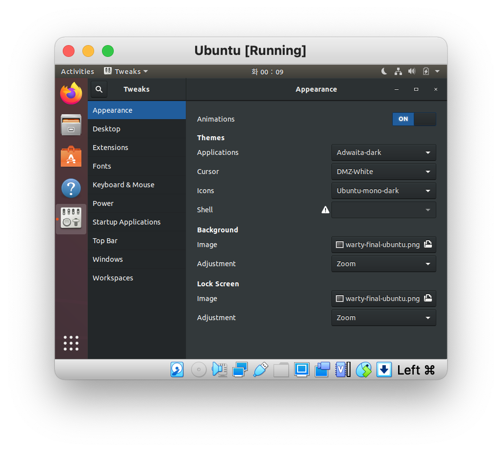
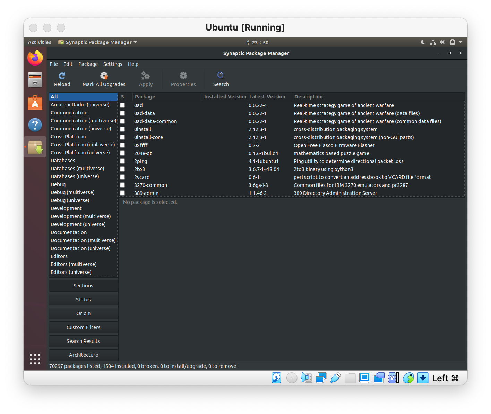

# Ch5 - System Configuration from the Graphical Interface

## Introduction and Learning Objectives

👩🏻‍🏫 **Learning Objectives**

- Apply system, display, and date and time settings using the *System Settings* panel.

- Track the network settings and manage connections using *Network Manager* in Linux.
- Install and update software in Linux from a graphical interface.

## System, Display, Date and Time Settings

https://wnw1005.tistory.com/44 여기 링크 참고해서 gnome-tweaks를 설치했다.

```bash
$ sudo apt install gnome-tweaks
```

아래와 같이, 일반 설정에서는 노출되지 않았던 설정들을 할 수가 있다.



### Network Time Protocol (NTP)

리눅스는 기본적으로 내부 timekeeping을 위해 UTC(Coordinated Universal TIme)를 사용한다. UTC는 GMT(Greenwich Mean Time)과 유사하지만 더 정확한 시간이다.

NTP(Network Time Protocol)은 인터넷 서버를 통해 로컬 타임을 설정할때 사용되는 가장 인기많고 믿을만한 프로토콜이다. 리눅스 배포판들에는 항상 작동하는 NTP setup이 되어있기때문에 사용자가 network time synchronization을 위해 별도의 설정을 할 필요가 없다.

만약 필요하다면 `/ect/ntp.conf` 에서 standard NTP config file을 수정해서 더 세부적인 설정을 할 수 있다.

## Network Manager

### Network Configuration

모든 리눅스 배포판들은 network configuration files가 있지만, 파일 형식이랑 위치는 배포판마다 다르다. 이 파일들을 일일히 수정하는 것은 복잡하기에 Network Manager를 사용해 다른 배포판들에서도 일관성 있게 네트워크 설정을 할 수 있다.

Network Manager은 사용가능한 네트워크들을 리스트하고 (유선/무선), 비밀번호를 관리하고, VPN을 세팅할 수 있다. 특별한 경우가 아니라면 Network Manager이 연결을 담당하게 하는 것이 좋다.

### Wired and Wireless Connections

**유선 연결**은 일반적으로 복잡한 수동 설정을 요하지 않는다. 하드웨어 인터페이스와 시그널이 자동으로 감지되어, Network Manager이 DHCP(Dynamic Host Configuration Protocol)에 기반해 실제 네트워크 설정을 한다.

DHCP를 사용하지 않는 static 설정의 경우에도, Network Manager을 통해 수동 설정을 쉽게 할 수 있다. 하드웨어가 지원한다면 이더넷 MAC(Media Access Control)주소도 변경할 수 있다.

[참고 - MAC 주소란?] - 네트워크 카드의 unique한 hexadecimal number

**무선 연결**은 유선 연결과 달리 그냥 연결되진 않는다. Network Manager을 통해 사용가능한 무선 네트워크의 목록을 볼 수 있고, 알려진 무선 네트워크를 추가/수정/삭제하거나, (존재할 경우) 기본값으로 연결하고 싶은 네트워크를 설정할 수 있다.

### Mobile Broadband and VPN Connections

Network Manager을 통해 mobile broadband connection과 VPN 연결을 관리할 수 있다.

## Installing and Updating Software

리눅스 배포판의 각 패키지들은 리눅스 커널, C 컴파일러, USB 장치와 상호작용하기 위한 공통 소프트웨어 코드, 파이퍼폭스 웹 브라우저와 같은 시스템의 한 부분을 제공한다.

이러한 패키지들은 서로서로 dependency가 있다. 예를 들면 파이어폭스는 SSL/TLS를 통해 통신하기때문에 SSL,TLS 통신을 암호화하고 복호화하는 패키지에 depencency가 있다. 따라서 이 패키지가 동시에 설치되지 않는 한 firefox도 설치되지 않을 것이다.

모든 시스템은 이렇게 lower-level 유틸리티를 가지고 있고, 사용자는 이런 의존성들을 대신 관리해주고 인터넷에서 다운받아주는 higher-level 유틸리티를 다루게 된다.

이 챕터에서는 Linux에서 (Ubuntu 등에서도 사용되는) Debian packaging system과 (Red Hat, SUSE family 등에서도 사용되는)RPM packaging system을 통해 소프트웨어를 설치하고 업데이트 하는 방법에 대해 알아볼 것! 

### Debian Packaging

Debian family system에서 사용되는 Package Management에 대해 알아BOZA.

Debian family system에 내재하는 패키지 매니저는 **dpkg** 로, dpkg는 패키지를 설치, 삭제, 빌드는 하지만 higher-level package management system들처럼 자동으로 의존성을 설치해주지는 않는다.

Debian-based system들에서는 **APT** (Advanced Package Tool)이라는 higher-level package management system을 사용한다. 일반적으로 배포판들은 apt, apt-get처럼 APT 상위에 자신들만의 user interface를 생성해서 사용한다.

일반적으로 apt repository들은 각 배포판들 간에 호환가능하지만, apt repository 내의 소프트웨어는 호환이 안되는 경우가 많다. 따라서 일반적으로 소프트웨어 판매자?(distributor)들은 다양한 배포판을 지원하기 위해 여러 repository를 ship한다.

### Red Hat Package Manager (RPM)

RPM은 Linux 배포판에서 많이 쓰이는 또다른 Package Management! 레드햇에서 개발했고, SUSE/penSUSE, Mageia, CentOS, Oracle Linux를 포함한 다양한 배포판에 적용되었다.

Higher-level package management system은 배포판들 마다 다르다. Red Hat는 yum에서 사용되는 repository format을, RHEL/Cent OS8, Fedora는 dnf를, SUSE family 배포판들은 RPM을 사용하지만 zipper interface를...등등...

### Installing and Updating Software in Ubuntu

Ubuntu에는 기본적으로 Ubuntu Software이 깔려있긴 하지만, 이 친구는 외부 소프트웨어를 설치하는 데에는 편리하지만(?) 일반적인 packaging system에 있는 패키지를 찾기에는 부족하다.

그 대신 사용되는 인터페이스가 바로 **Synaptic**이다. [참고](https://myubuntu.tistory.com/entry/%EC%99%84%EC%A0%84%EC%A0%95%EB%B3%B5-%EC%8B%9C%EB%83%85%ED%8B%B1-%ED%8C%A8%ED%82%A4%EC%A7%80-%EA%B4%80%EB%A6%AC%EC%9E%90-0625) Synaptic은 터미널에서 작동하는 APT 패키지 관리자에 GUI를 입혀놓은 것이다.



카테고리로 패키지들이 구분되어 있고, 패키지를 검색해서 다운받을 수도 있으며, 설치된 패키지를 삭제할 수도 있다.

Synaptic은 우분투가 이해하는 database에 이미 존재하는 패키지들만을 찾아주고, Ubuntu Software Center은 이와 달리 외부 자원들을 찾는다.

