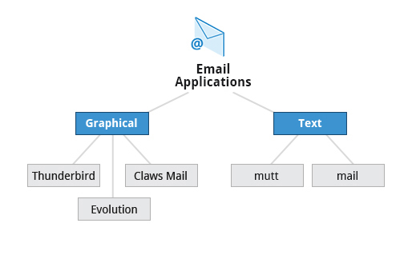

# Ch6 - Common Applications

## Introduction and Learning Objectives

👩🏻‍🏫 **Learning Objectives**

다음과 같은 common Linux applications에 익숙해지기

- Internet applications such as browsers and email programs.

- Office Productivity Suites such as LibreOffice.
- Developer tools, such as compilers, debuggers, etc.
- Multimedia applications, such as those for audio and video.
- Graphics editors such as the GIMP and other graphics utilities.

## Internet Applications

전 세계 유저들이 다양한 일을 할 수 있게끔 하는 global network인 인터넷의 장점을 누리려면, 당연히 network-aware application을 사용해야 한다. 예를 들면 아래와 같은 👀

- Web browsers
- Email clients
- Streaming media applications
- Internet Relay Channels
- Conferencing Software

### Web Browsers

리눅스는 아주 아주 다양한 웹 브라우저의 선택지를 제공한다! Graphical, text-based 웹 브라우저 모두!

- Firefox
- Google Chrome
- Chromium
- Epiphany (renamed web)
- Konqueror
- linx, lynx, w3m
- Opera

### Email Applications

인터넷에서 메시지를 송/수신하고, 읽는 이메일 어플리케이션! 리눅스는 여러 email clients(both graphical, text-based)를 지원한다. 추가적으로, 많은 유저들은 그냥 웹 브라우저에서 간단하게 이메일 계정에 접근할 수 있다.

대부분의 이메일 클라이언트는 IMAP(Internet Message Access Protocol) 또는 좀 더 오래된 POP(Post Office Protocol)을 사용해서 remote mail server에 저장된 이메일에 접근한다.

대부분의 이메일 어플리케이션은 사진과 하이퍼링크가 포함된 HTML 포맷의 이메일도 보여준다. 더 발전된 이메일 어플리케이션들은 주소록/연락처를 불러오거나, 다른 이메일 어플리케이션의 이메일도 보여주는 등의 기능이 있다.

리눅스는 아래와 같은 이메일 어플리케이션들을 지원한다.

- Graphical email clients, such as Thunderbird, Evolution, and Claws Mail
- Text mode email clients, such as Mutt and mail
- All web browser-based clients, such as Gmail, Yahoo Mail, and Office 365.

### Other Internet Applications

리눅스는 인터넷 관련 일들을 수행하기 위한 다른 애플리케이션들도 지원한다. 예시는 아래와 같다.

[출처](https://learning.edx.org/course/course-v1:LinuxFoundationX+LFS101x+1T2020/block-v1:LinuxFoundationX+LFS101x+1T2020+type@sequential+block@59a48c398fe24ca8822fb797580b06d3/block-v1:LinuxFoundationX+LFS101x+1T2020+type@vertical+block@c9196814b3094d95885a5af39bc73acf)

| 어플리케이션  | **용도**                                                     |
| ------------- | ------------------------------------------------------------ |
| **FileZilla** | Intuitive graphical FTP client that supports FTP, Secure File Transfer Protocol (SFTP), and FTP Secured (FTPS). Used to transfer files to/from (FTP) servers. |
| **Pidgin**    | To access GTalk, AIM, ICQ, MSN, IRC and other messaging networks. |
| **Ekiga**     | To connect to Voice over Internet Protocol (VoIP) networks.  |
| **Hexchat**   | To access Internet Relay Chat (IRC) networks.                |

 ## Productivity and Development Applications

최근의 컴퓨터 시스템은 (office suites라고도 불리는) 생산성 어플리케이션들이 설치되어 있거나 사용가능하다. 각각의 suite는 Text, Spreadsheets, Presentations, Graphical Objects 등의 파일들을 생성하고 편집하기 위한 프로그램들의 집합이다.

대부분의 Linux 배포판들은 LibreOffice를 제공한다. 다른 office suites들도 많지만 LibreOffice가 가장 성숙하고, 널리 쓰이고 많이 개발되었다😀

이 외에도 리눅스 사용자들은 Google Docs나 Microsoft Office 365와 같은 인터넷 기반의 office suites도 사용 가능하다.

### LibreOffice Components

LibreOffice에는 아래와 같은 컴포넌트 어플리케이션들이 포함되어 있다.

- Writer: Word Processing

- Calc: Spreadsheets
- Impress: Presentations
- Draw: Create and edit graphics and diagrams.

LibreOffice에서는 MS office에서 사용되는 포맷처럼 non-native 문서 포맷도 읽고 수정할 수 있다.

### Development Applications

리눅스 배포판들은 유저 어플리케이션 또는 커널 개발/유지보수를 위한 application들과 도구를 모두 지원한다.

- advanced editors (e.g. vi, emacs)
- 모든 컴퓨터 언어를 위한 컴파일러 (e.g. c, c++을 위한 gcc)
- Debuggers (e.g. gdb)와 여러 Debugger graphical front ends, other debugging tools (e.g. valgrind)
- 퍼포먼스 측정, 모니터링 프로그램
- 위 모든 것들을 포함한 통합 IDE (e.g. Eclipse)

다른 OS에서는 위 툴들을 (주로 유료로) 각자 설치해야 하지만, 리눅스에서는 다 무료로 standard package installation system을 통해 이용가능하다.

## Multimedia Applications

음악 듣고, 영상 보고, 텍스트/그래픽을 표현하고...등등을 위한 멀티미디어 어플리케이션도 지원한다.

[Sound Players]

- Amarok
- Audacity
- Rhythmbox

등등... 추가적으로 Pandora나 Spotify와 같은 상업적 온라인 음악 스트리밍 서비스들도 웹브라우저를 통해 사용할 수 있다.

[Movie Players]

- VLC
- MPlayer
- Xine
- Totem

등등...

[Movie Editors]

영상을 편집하기 위한 무비 에디터도 지원한다. Cinepaint, Blender, Cinelerra, FFmpeg 등등!

## Graphics Editors and Utilities

다양한 포맷(JPEG/JPG, PNG, GIF, TIFF 등)의 이미지를 생성/수정/열람/정리하기 위한 그래픽 에디터들도 지원한다. 

어도비 포토샵처럼, 리눅스 배포판에서는 **GIMP**(GNU Image Manipulation Program)라는 feature-rich image retouching/editing tool을 지원한다.

- 모든 이미지 포맷 지원
- 다양한 plugin/filter 제공
- 레이어, 채널,  histogram과 같이 이미지와 관련된 다양한 정보를 제공

GIMP 외에, eog, Inkscape, convert, Scribus와 같은 다양한 이미지 관련 작업을 지원하는 그래픽 유틸리티도 제공한다. 상세한 기능은 알아서 찾아BOZA....

