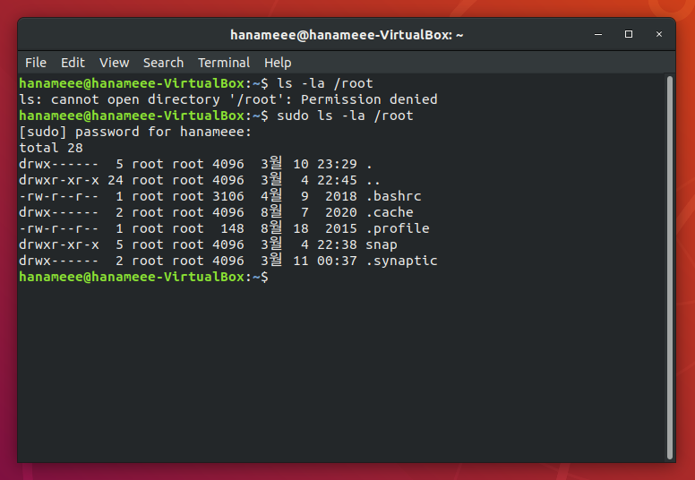
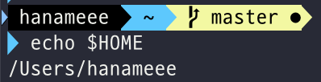
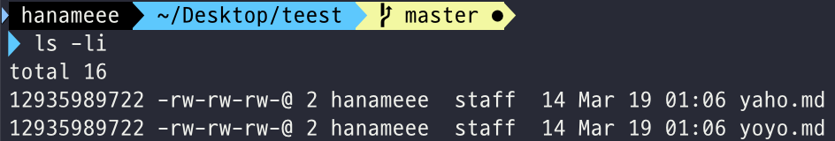
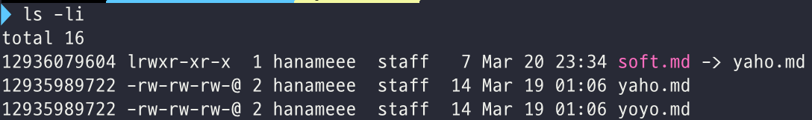
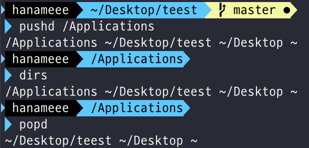
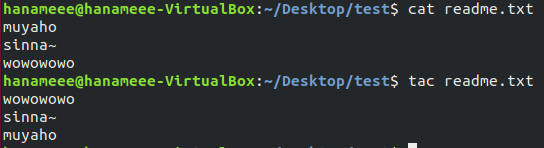
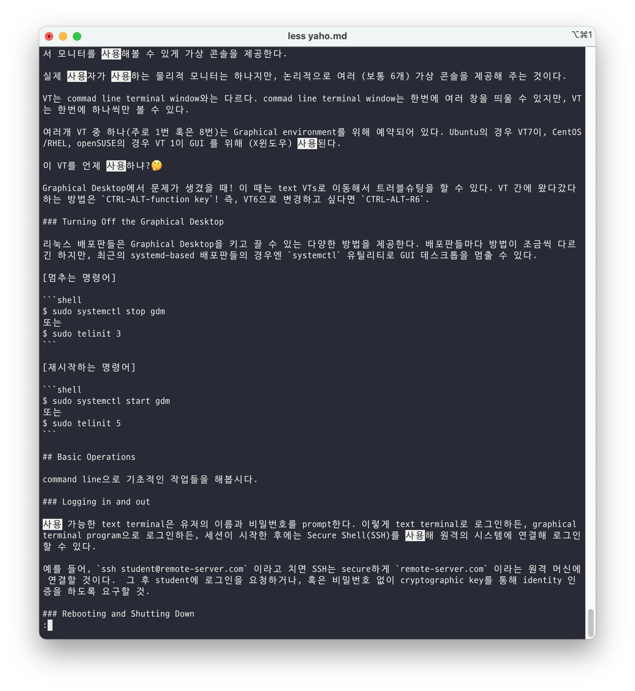
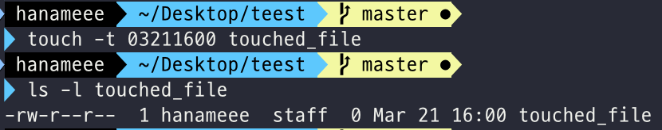

# Ch7 - Command Line Operations

## Introduction and Learning Objectives

👩🏻‍🏫 **Learning Objectives**

리눅스의 🌸꽃🌸 command line operations에 대해 배워보자.

- Use the command line to perform operations in Linux.
- Search for files.
- Create and manage files.
- Install and update software.

## Command-Line Mode Options

### Introduction to the Command Line

GUI는 쉬운 일을 더 쉽게 만들어주고, CLI(Command Line Interface)는 어려운 일들을 할 수 있게 만들어준다고 한다. CLI가 가지는 장점은 아래와 같다.

- GUI 오버헤드가 없다.
- Command Line에서 사실상 어떤 일이든지 할 수 있다.
- 자주 쓰이지만 잊어버리기 쉬운 일, 절차의 집합들에 대해 스크립트를 적용할 수 있다.
- 어디서든지 인터넷 상의 원격 머신에 접속할 수 있다.
- 메뉴를 찾아 헤매는 대신 command line에서 바로 graphical application을 실행할 수 있다.
- graphical tool은 배포판 간에 차이가 있지만, cli는 아니다. 배포판 간에 동일하다.

### Using a Text Terminal on the Graphical Desktop

터미널 에뮬레이터 프로그램은 마치 우리가 순수 text terminal을 통해 머신에 로그인하는 것처럼 데스크톱의 윈도우 내에서 terminal을 emulates 한다. 대부분의 터미널 에뮬레이터 프로그램은 multiple terminal sessions도 지원한다.

GNOME 데스크톱 환경에서는 기본적으로 윈도우에서 text-mode terminal을 emulate 하기 위해 **gnome-terminal** 앱이 사용된다.

다른 사용 가능한 터미널 프로그램은 아래와 같다.

- xterm
- rxvt
- konsole (default on KDE)
- terminator

### Some Basic Utilities

기초가 되는 명령어들에 대해 알아보자. 일단 아래 명령어들은 파일의 내용을 확인하기 위해 사용하는 명령어들!

|      |                           |                                                              |
| ---- | ------------------------- | ------------------------------------------------------------ |
| cat  | $ cat [옵션] [파일명(들)] | 파일 이름(들)을 인자로 받아서 터미널 화면에 그대로 뿌려준다. 2개 이상의 파일이름이 지정되면 모든 파일이 연결되어 보여진다. |
| head | $ head [파일명]           | 파일의 앞 부분부터 확인하는 명령어로, 기본적으로 파일의 앞부분부터 10행까지만 출력한다. |
| tail | $ head [tail]             | 파일의 뒷 부분부터 확인하는 명령어로, 기본적으로 파일의 마지막 부분부터 10행까지만 출력한다. 특정 파일에 계속 추가되는 모든 내용을 모니터링 할 수 있어 실무에서 유용하다. |
| man  | man [명령어]              | 각종 명령어, 프로그램의 사용법(manual)을 확인한다. 예를 들어 `rm` 명령어의 매뉴얼을 확인하고 싶다면 `man rm` 처럼 사용한다. 간단한 사용법을 사용할 때는 `rm --help` 도 가능! |

설명 출처: https://webdir.tistory.com/142

### The Command Line

Shell prompt에 입력되는 대부분의 인풋은 아래의 3가지 기본 요소를 가진다.

- Command: 실행하는 프로그램의 이름
- Options: 커맨드가 어떤 것을 실행할지에 대한 설정을 부여하는 옵션. 주로 `-` 이나 `--`로 시작함
- Arguments

물론 이 요소들 중 없는게 있을 수도, 다른 요소들이 있을 수도 있음.

### sudo

**sudo**는 유저가 root (superuser)의 보안 권한을 이용해 프로그램을 실행할 수 있게 해준다. 아래 사진처럼, 일반 유저로는 권한이 막힌 디렉토리에 대한 접근도 `sudo`를 이용하면 가능가능.



Ubuntu를 비롯해 최근의 리눅스 배포판에서는 설치 과정에서 sudo가 항상 설정되어 있다. 

### Switching Between the GUI and the Command Line

리눅스는 GUI를 임시적으로 혹은 영구적으로 제거할 수 있게 해준다. Linux production servers는 대개 GUI 없이 설치되고, 만약 GUI가 설치되었더라도 시스템 시작 중에는 런칭하지 않는다.

Production 서버에서 Graphical interface를 제거하는 것은 lean system을 유지하는 데에 도움이 된다.

### Virtual Terminals (VT)

참고 링크: https://jhnyang.tistory.com/51, https://dololak.tistory.com/329

가상 콘솔(가상 터미널)에 대해 알아BOZA.

멀티 유저 시스템인 리눅스는, 하나의 리눅스 서버에 다수의 사용자가 접속할 수 있다. 이에 리눅스는 로컬 컴퓨터에서 모니터를 사용해볼 수 있게 가상 콘솔을 제공한다.

실제 사용자가 사용하는 물리적 모니터는 하나지만, 논리적으로 여러 (보통 6개) 가상 콘솔을 제공해 주는 것이다.

VT는 commad line terminal window와는 다르다. commad line terminal window는 한번에 여러 창을 띄울 수 있지만, VT는 한번에 하나씩만 볼 수 있다.

여러개 VT 중 하나(주로 1번 혹은 8번)는 Graphical environment를 위해 예약되어 있다. Ubuntu의 경우 VT7이, CentOS/RHEL, openSUSE의 경우 VT 1이 GUI 를 위해 (X윈도우) 사용된다.

이 VT를 언제 사용하냐?🤔

Graphical Desktop에서 문제가 생겼을 때! 이 때는 text VTs로 이동해서 트러블슈팅을 할 수 있다. VT 간에 왔다갔다하는 방법은 `CTRL-ALT-function key`! 즉, VT6으로 변경하고 싶다면 `CTRL-ALT-R6`.

### Turning Off the Graphical Desktop

리눅스 배포판들은 Graphical Desktop을 키고 끌 수 있는 다양한 방법을 제공한다. 배포판들마다 방법이 조금씩 다르긴 하지만, 최근의 systemd-based 배포판들의 경우엔 `systemctl` 유틸리티로 GUI 데스크톱을 멈출 수 있다.

[멈추는 명령어]

```shell
$ sudo systemctl stop gdm
또는
$ sudo telinit 3
```

[재시작하는 명령어]

```shell
$ sudo systemctl start gdm
또는
$ sudo telinit 5
```

## Basic Operations

command line으로 기초적인 작업들을 해봅시다.

### Logging in and out

사용 가능한 text terminal은 유저의 이름과 비밀번호를 prompt한다. 이렇게 text terminal로 로그인하든, graphical terminal program으로 로그인하든, 세션이 시작한 후에는 Secure Shell(SSH)를 사용해 원격의 시스템에 연결해 로그인할 수 있다.

예를 들어, `ssh student@remote-server.com` 이라고 치면 SSH는 secure하게 `remote-server.com` 이라는 원격 머신에 연결할 것이다.  그 후 student에 로그인을 요청하거나, 혹은 비밀번호 없이 cryptographic key를 통해 identity 인증을 하도록 요구할 것.

### Rebooting and Shutting Down

시스템을 종료하거나 재부팅하기 위해 선호되는 방법은 `shutdown` 명령어를 사용하는 것이다. 이 명령어는 경고 메세지를 보내고, 이후 유저들이 로그인하는 것을 막는다! 

그 후 init process가 시스템을 종료하거나 재부팅하는 것을 컨트롤한다.

- `halt` , `poweroff` : `shutdown -h` 를 issue한다.

- `reboot`: `shutdown -r` 을 issue한다.

### Locating Applications

배포판에 따라 프로그램과 소프트웨어 패키지가 다양한 디렉토리에 설치되긴 하지만, 일반적으로 실행 가능한 프로그램/스크립트는 `/bin`, `/usr/bin`, `/sbin`, `/usr/sbin` , `/opt`, `/usr/local/bin`, `/usr/local/sbin`, 또는  `/home/student/bin` 처럼 유저 계정 공간에 위치한다.

프로그램이 어디 있는지 찾기 위해서 사용할 수 있는 유틸리티는 **which**이다!


이런 식으로 특정 프로그램이 파일시스템 내 어디에 위치해 있는지를 정확히 찾을 수 있다. 만약 which가 찾지 못한다면, **whereis** 유틸리티가 대안이 될 수 있다! whereis는 where보다 더 넓은 범위에서 패키지를 찾기 때문이다.

### Accessing Directories

처음 시스템에 로그인하거나 터미널을 열었을 때, 기본 디렉토리는 `home` 디렉토리다! home 디렉토리의 정확한 path 값은 `echo $HOME` 으로 확인할 수 있다.



실제로 많은 리눅스 배포판들이 새 graphical terminal을 `$HOME/Desktop` 에서 연다!_!

 아래는 디렉토리 탐색에 유용한 명령어들

| **Command**                    | **Result**                                                   |
| ------------------------------ | ------------------------------------------------------------ |
| pwd                  | Displays the present working directory                       |
| cd ~ 또는 cd.. | Change to your home directory (shortcut name is ~) |
| cd ..        | Change to parent directory                    |
| cd -             | Change to previous directory           |

### Understanding Absolute and Relative Paths

경로를 표현하는 2가지 방법이 있다.

- 절대경로: root directory부터 시작하는 경로로, **항상 `/` 로 시작한다.**
- 상대경로: 현재 작업 디렉토리 (pwd)부터 시작하는 경로로, **절대 `/` 로 시작하지 않는다.** 현 디렉토리를 표현하는 `.`, 부모 디렉토리를 표현하는 `..` 과 home 디렉토리를 표현하는 `~` 를 사용해 상대경로를 표현한다.

### Exploring the Filesystem

파일시스템을 traverse 하는건 꽤나 번거롭다. 이때, `tree` 명령어를 통해 파일시스템 트리를 편리하게 볼 수 있다. `tree -d`  를 사용하면 파일을 제외한 폴더 목록만 깔끔하게 볼 수도 있다.

아래는 파일시스템을 돌아다니는데 도움이 되는 명령어들!

| **Command** | **Usage**                                                    |
| ----------- | ------------------------------------------------------------ |
| cd /        | Changes your current directory to the root (/) directory (or path you supply) |
| ls          | List the contents of the present working directory           |
| ls -a       | List all files, including **hidden files and directories**   |
| tree        | Displays a tree view of the filesystem                       |

아래처럼 ls 뒤에 열람을 원하는 파일 명만을 기입하면 해당 파일들의 정보만 파악할 수 있다.

```bash
ls -l file1 file2
```

### Hard Links, Soft Links

Hard Link, Soft Link는 모두 유닉스 (계열의) 시스템을 사용할 때 파일을 쉽게 사용할 수 있게 도와주는 기능이다. 하나의 원본 파일에 두 개 이상의 이름을 유지하는 방법을 제공하는 것이 바로 링크이고, 링크 생성을 통해 편리하게 파일과 디렉토리를 관리할 수 있다. 

하드링크, 소프트링크 모두 `ln` 명령어 (소프트링크의 경우 -s 옵션 추가)로 만든다.

#### Hard Links 

하드링크는 `ln -s [원본이름] [하드링크이름]` 으로 생성한다.

하드 링크는, 파일의 복사본과 유사하지만 `cp`(파일 복사 명령어)와는 다르다. 하드링크는 원본과 같은 **inode** 를 가지는 복사본을 만들고, 하드링크를 수정하면 원본과 원본에서 파생된 다른 하드링크들이 동일하게 수정된다.

[참고: inode란?]

`ls -li` 를 해보면 아래처럼 가장 좌측에 뜨는 8자리의 고유번호가 있다 (`-l`: 일련의 정보를 보여주는 플래그, `-i`: inode를 보여주는 플래그)

이 번호가 바로 inode이고, inode는 마치 사람의 주민번호와 같이, 파일이 생성될 때마다 생기는 고유의 번호이다.



원본을 지우더라도 하드링크는 보존되며, 동일한 데이터로 실행할 수 있다.

#### Soft Links

소프트 링크는 `ln -s [원본이름] [소프트링크이름]` 으로 생성한다.

소프트 링크는 바로가기 아이콘과 유사하다. 원본을 복사하고, 어디에서 수정을 하든 내용이 함께 변경된다. 하지만 원본을 삭제했을 때도 상관없는 하드 링크와는 달리, 소프트 링크는 원본을 삭제하게 되면 연결이 끊겨 무용지물이 되버린다. (다만, 삭제된 원본과 동일한 이름의 파일이 생기면 링크가 다시 연결된다.)

또, 하드 링크와는 달리 소프트 링크는 원본과 다른 inode를 가지고, 파일 권한 부분에서 맨 앞에 l이 붙는다. (아래 사진 예시에서 `soft.md`)



#### 하드 링크 vs 소프트 링크 (심볼릭 링크, symlink)

|                  | **하드 링크**                                | **심볼릭 링크**                           |
| ---------------- | -------------------------------------------- | ----------------------------------------- |
| **복제 형태**    | 원본 복사                                    | 바로가기 생성                             |
| **용량**         | 원본 데이터 만큼 차지                        | 없음                                      |
| **i Node 값**    | 원본과 공유                                  | 공유 x                                    |
| **데이터 Sync**  | 원본 변경 시 링크 본 도 변경됨 (반대도 성립) |                                           |
| **생성 대상**    | 파일만 가능                                  | 파일 및 폴더                              |
| **파일 시스템**  | 동일한 파일 시스템에만 생성 가능             | 다른 파일 시스템에도 생성 가능            |
| **구분 방법**    | 구분이 어려움 (i-node 값으로 확인해야 함)    | li 명령어 수행 시 가장 왼쪽에 l로 표시됨  |
| **원본 삭제 시** | 하드 링크 데이터 그대로 사용 가능            | 사용 불능 (원본 경로 생성 시 다시 연결됨) |

표 출처: https://funfunit.tistory.com/28 

[참고 링크]

https://6kkki.tistory.com/10 

### Navigating the Directory History

`cd` 명령어로 이동할 시 이전에 방문했던 디렉토리가 저장되어 `cd -`로 재방문 할 수 있다. 만약 하나 이상의 과거 방문 디렉토리를 기억하고 싶다면, `cd` 대신 `pushd`를 사용하면 된다. pushd를 사용하면 방문한 디렉토리들을 list에 추가해서 기억하고, `popd`를 통해 후입선출로 과거 방문 디렉토리를 재방문할 수 있다.

디렉토리들의 목록은 `dirs` 명령어로 파악할 수 있다.



## Working with Files

### Viewing Files

파일을 열람하기 위해 사용할 수 있는 유틸리티들은 아래와 같다.

You can use the following command line utilities to view files:

| **Command** | *Usage\****                                                  |
| ----------- | ------------------------------------------------------------ |
| cat         | 많이 길지 않은 파일을 열람하기 위해 사용하는 명령어. scroll-back을 지원하지 않는다. |
| tac         | <br /> |
| less        | paging program이라서 cat보다 큰 파일을 열람하기 위해 사용하는 명령어이다. Scroll-back 지원, 검색, navigate 지원 등등...<br /> 앞에서부터 검색할 때는 `/ [검색어]` 를, 뒤에서부터 검색할 때는 `? [검색어]` 를 이용하면 된다. 검색 후 일치하는 다음 문자열로 이동할 때는 `n`, 일치하는 이전 문자열로 이동할 때는 `N` 을 사용한다. |
| tail        | 파일의 마지막 10줄을 출력한다. `-n 원하는 줄 수 (ex. -n 15)` 나 혹은 더 짧게 `-원하는 줄 수 (ex. -15)` 옵션을 넘겨서 열람이 필요한 줄 수를 변경할 수 있다. |
| head        | tail의 정반대 동작. 파일 앞에서부터 10줄을 출력한다. 마찬가지로 옵션을 넘겨서 열람하고 싶은 줄 수를 변경 가능하다. |

### touch

touch는 파일의 접근 권한 설정/수정, 파일의 수정시간을 변경하기 위해 자주 사용된다. 기본적으로 touch는 파일의 timestamp를 현재 시간으로 리셋한다.

하지만, touch를 사용해 아래처럼 빈 파일을 만들 수도 있다.

```bash
touch [파일이름]
touch [파일이름1] [파일이름2] # 한꺼번에 여러개의 파일도 만들 수 있다
```

touch에는 여러 다양한 옵션들이 있는데, `-t` 옵션을 이용하면 파일의 timestamp를 함께 설정할 수 있다.

```bash
touch -t 03211600 touched_file # 3월 21일, 16시(4pm)로 timestamp가 설정된 touched_file을 생성 
touch -t 1803141400 past_touched_file # 연도를 명시해서 올해가 아닌 연도로 ex.2018년 3월 14일 14시(2pm) 생성할 수도 있음
```



### mkdir and rmdir

**mkdir** 은 디렉토리를 생성하기 위해 사용된다. 파일 이름만 명시하면 현 디렉토리 하에 새로운 디렉토리를 생성하고, 디렉토리 path를 명시해주면 특정 디렉토리 하에 새로운 디렉토리를 생성할 수 있다.

```bash
mkdir sampdir # 현 디렉토리 하에 sampdir 생성
mkdir /usr/sampdir # /usr 하에 sampdir 생성
```

`-p` 옵션을 이용하면 subdirectory를 가진 디렉토리도 만들 수 있다. 

```bash
mkdir -p /tmp/somedir/subdir # -p 옵션 없이 subdir이 있는 somedir을 만들려고 시도하면 에러가 난다.
```

**rmdir** 은 디렉토리를 삭제하기 위해 사용된다. 비어있는 디렉토리만 삭제할 수 있는데, `rm -rf` 명령어를 사용하면 빈 디렉토리가 아니어도 삭제할 수 있다. (디렉토리 하의 모든 내용이 함께 삭제된다.)

rm -rf는 하위 디렉토리를 재귀적으로 돌며 하위의 모든 것들을 삭제하기 때문에 짱짱 편리하지만 짱짱 위험하다. 특히 root 디렉토리에서 사용하면 정말 아찔한 것이다...조심해서 사용하도록 하자.

### Moving, Renaming or Removing a File

**mv** 명령어는 파일을 단순히 rename 하는 역할과, (파일을 rename 하는 동시에) 파일 위치를 옮기는 역할 2가지를 할 수 있다. 파일 뿐만 아니라 **디렉토리**이동/rename에도 mv 명령어롤 사용한다.

**rm** 명령어는 파일을 삭제하는 명령어이다. `-f` 옵션으로는 강제 삭제를. `-i` 옵션으로는 interactive 삭제를 할 수 있다. 만약 정규표현식 등으로 파일을 삭제할 경우 -i 옵션으로 삭제하면 패턴에 매칭되어 삭제되는 파일들이 어떤 친구들인지 확인하고 안전하게 삭제할 수 있다.

### Modifying the Command Line Prompt

쉘 변수 부분 참고 링크: https://webdir.tistory.com/105

리눅스에서는 현재 사용자의 시스템 사용환경을 개별적으로 사용할 수 있게 지원하는 사용자 별 시스템 환경변수가 있고, 이를 **쉘 변수** 라고 한다.  `env` 명령어를 통해 쉘 변수들을 확인할 수 있다.

쉘 변수들 가운데, **PS1** 이라는 변수는 우리가 사용하는 쉘 변수의 모양을 결정한다.

```bash
echo $PS1 # 쉘 변수를 출력
```

$PS1 을 변경하면, 터미널의 프롬프트에 출력되는 문자를 변경할 수 있다. 현재 사용자 명, 시간 등등 다양한 쉘 변수 기호를 이용해 정보를 표시할 수 있다. 일례로, 아래와 같이 PS1을 설정하면

```bash
$ PS1="\u@\h \$ "
```

`\u`는 사용자명을, `/h`는 호스트명을 의미하기에 사용자명과 호스트명을 프롬프트에서 확인할 수 있다.

