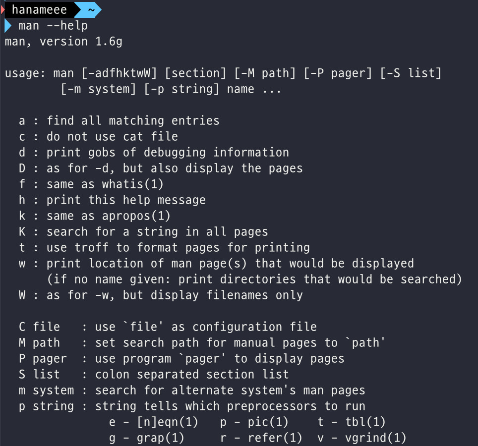
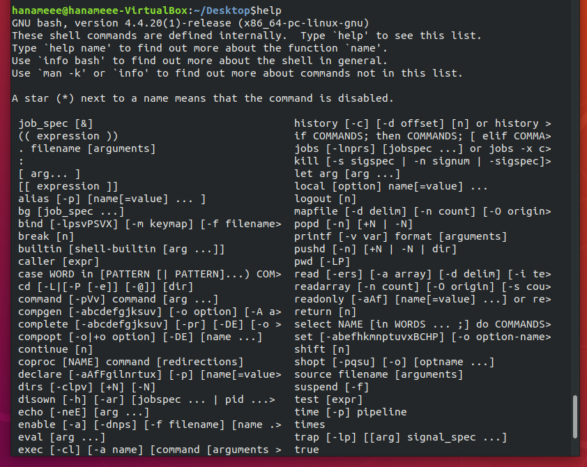
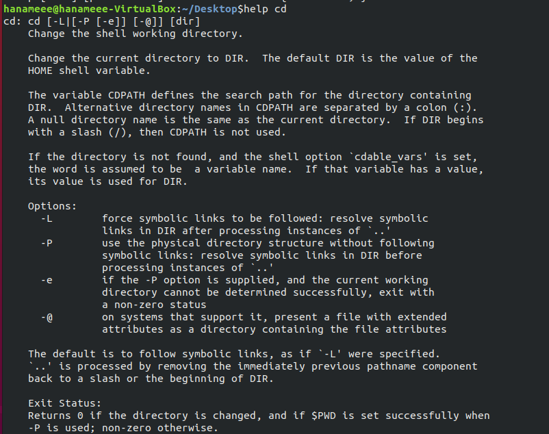

# Ch8 - Finding Linux Documentation

## Introduction and Learning Objectives

👩🏻‍🏫 **Learning Objectives**

- Use different sources of documentation.
- Use the man pages.
- Access the GNU info System.
- Use the **help** command and **--help** option.
- Use other documentation sources.

## Documentation Sources

리눅스를 사용하다 보면 항상 문서를 참고해야 하는데, 많은 리눅스 배포판들에서는 도움이 될만한 문서들을 다양한 형식으로 정리해두었다!

주요한 리눅스 문서 출처들엔 아래와 같은 것들이 있다.

- **man** 페이지 (manual pages의 줄임말)
- GNU Info
- help 명령어와 --help 옵션
- [Gentoo Handbook](https://www.gentoo.org/support/documentation/) or [Ubuntu Documentation](https://help.ubuntu.com/community/CommunityHelpWiki) 같은 공식 문서들!

## The man pages

**Man pages**는 가장 자주 쓰이는 리눅스 문서이다. man pages는 많은 프로그램과 유틸리티 뿐만 아니라, 설정 파일들, system call을 위한 programming API들, library routines, 그리고 커널에 대한 상세한 문서를 제공한다.

> The **man** program searches, formats, and displays the information contained in the man page system.

Man pages (aka. 매뉴얼 페이지)는 모든 리눅스 배포판에 존재하며, 쉽게 찾을 수 있다. 그냥 `man` 뒤에 정보를 얻고 싶은 argument를 넘겨주면 됨!

[Linux man pages online](http://man7.org/linux/man-pages/) 같은 곳에서 웹페이지로도 열람할 수 있다. 

### man

man 프로그램은 man page system에 포함된 정보를 검색하고, 포맷하고, 출력한다. 대부분의 토픽들은 정보량이 많기 때문에, 결과물이 `less`와 같은 pager 프로그램으로 piped되어 출력된다.

뒤에 옵션을 줄 수도 있다.

- `man -f` 는 `whatis` 와 같다
- `man -k`는 `apropos`와 같다

### manual chapters

man 페이지는 1~9까지의 챕터로 나뉜다. 몇몇 경우에는 특정 토픽을 표시하기 위해 뒤에 알파벳 하나가 붙는 경우도 있다. 일례로, X Window API를 설명하는 페이지의 경우 `3X`!

챕터 숫자는 man에서 특정 챕터의 페이지를 출력하도록 할때 사용된다.

```shell
man 7 socket # 챕터 7
man -a socket # 모든 챕터들 (...?)
```

## GNU Info System

GNU Info System 역시 리눅스 문서의 소스 중 하나로, GNU 프로젝트의 표준 문서 포맷이다.

`info` 명령어로 사용할 수 있고, `man`과 유사한 점이 많다. 다만, 토픽들이 링크를 통해 이어져있다는 차이가 있다. cli, gui 유틸리티, 웹 등 다양한 매체로 볼 수 있다.

### cli로 info 사용하기

```shell
info socket
```

`info <topic name>` 으로 사용할 수 있다. Info 파일들에서 topic이 포함된 곳을 다 찾아줌!

### info 페이지 구조

info page의 topic을 **node**라고 부른다. 노드들 간에 이동하거나, 연속적으로 노드를 보는 것도 가능하다.

Items는 마치 브라우저의 링크와 유사하게 동작하고, item 이름 앞에 `*` 기호로 표시된다. Named Items는  item name 뒤의 `::` 기호로 표시된다. 

`/ <검색어>` 로 페이지 내 검색이 가능하다

## The --help Option and help Command

또다른 리눅스 문서의 소스는 `--help` 옵션!

대부분의 명령어는 `-h`나 `--help` 옵션으로 접근 가능한 짧은 설명이 있다.

```shell
man --help
```



앞의 man이나 Info 보다 빠르게, 짧은 레퍼런스를 찾을 수 있는 장점이 있다.

### help

bash command shell에서 빈번하게 사용되는 몇몇 명령어들은 (i.e. `echo`, `cd`) 다른 `/bin` 이나 `/usr/bin` 하의 바이너리와는 달리, 특별히 내장된 bash 버전의 명령어가 실행된다. 그래서 다른 명령어들보다 더 빠르고 효과적으로 (더 적은 리소스가 사용되므로) 실행된다!

help 명령어로는 요런 built-in 명령어들의 개요를 볼 수 있다



그리고 이런 built-in 명령어들에 한해서 `help <명령어>` 를 사용해 해당 명령어에 대한 정보를 열람할 수 있다.



## Other Documentation Sources

- Graphical Help System: GNOME에서는 `gnome-help` 또는 `yelp`로 gui 도움말을 띄울 수 있다.
  - `yelp man:cat` 과 같은 명령어로 cat에 대한 man page를 gui로 띄울 수 있다.
- Package Documentation: `/usr/share/doc` 디렉토리 하에, 각 패키지의 폴더로 구조화되어 존재한다.
- Online Resources
  - *[The Linux Command Line](http://linuxcommand.org/tlcl.php)* : 리눅스 커맨드라인 개론(?) 명세표(?)
  - [Ubuntu Documentation](https://help.ubuntu.com/) 

