# Ch9 - Processes

## Introduction and Learning Objectives

👩🏻‍🏫 **Learning Objectives**

- Describe what a process is and distinguish between types of processes.
- Enumerate process attributes.
- Manage processes using **ps** and **top**
- Understand the use of load averages and other process metrics.
- Manipulate processes by putting them in background and restoring them to foreground.
- Use **at**, **cron**, and **sleep** to schedule processes in the future or pause them.

## Introduction to Processes and Process Attributes

### Process란?

> A **process** is simply an instance of one or more related tasks (threads) executing on your computer.

프로세스는 메모리, CPU 사이클, 주변 장치 (네트워크 카드, 하드드라이브, 프린터, 디스플레이 등)와 같은 시스템 리소스를 사용한다.

OS(특히 커널)는 각 프로세스에 알맞게 리소스를 분배하는 역할을 하고, 전체적인 시스템 활용 최적화를 보증한다.

### Process Types

커맨드 쉘의 일종인 터미널은 필요한 만큼 실행되는 프로세스다. 쉘에서 detached 되어 background에서 수행되는 프로그램들도 있다.

프로세스들은 수행되는 일들에 따라 각기 다른 종류로 나뉜다.

| **Process Type**      | **Description**                                              | **Example**                        |
| --------------------- | ------------------------------------------------------------ | ---------------------------------- |
| Interactive Processes | 유저에 의해 시작 (커맨드 라인이나 gui 등) 되어야 하는 프로세스. | **bash, firefox, top**             |
| Batch Processes       | Automatic processes which are scheduled from and then disconnected from the terminal. These tasks are queued and work on a **FIFO** (First-In, First-Out) basis. | **updatedb, ldconfig**             |
| Daemons               | 지속적인 서비스 요청을 처리하기 위해 백그라운드에서 계속 실행되는 프로세스. 보통 프로세스 뒤에 `d`가 붙어있다. Many are launched during system startup and then wait for a user or system request indicating that their service is required. | **httpd, sshd, libvirtd**          |
| Threads               | **Lightweight processes**. These are tasks that run under the umbrella of a main process, sharing memory and other resources, but are scheduled and run by the system on an individual basis. An individual thread can end without terminating the whole process and a process can create new threads at any time. Many non-trivial programs are multi-threaded. | **firefox, gnome-terminal-server** |
| Kernel Threads        | Kernel tasks that users neither start nor terminate and have little control over. These may perform actions like moving a thread from one CPU to another, or making sure input/output operations to disk are completed. | **kthreadd, migration, ksoftirqd** |

### Process Scheduling and States

**스케줄러**라는 중요한 커널 기능은 끊임없이 CPU에 프로세스를 shift 한다. (적재했다가, 빼고, 적재했다가, 빼고...) 이 프로세스들은 상대 우선순위(얼마의 시간이 필요한지, 얼마의 시간이 이미 할당되었었는지...)에 따라 time sharing을 한다. 

#### Running

프로세스가 Running 상태라는 것은 - 현재 CPU에서 instruction을 실행하고 있는 중이거나 / 실행을 위해 time slice를 할당받아 기다리고 있는 상태라는 것.

Running 상태의 프로세스들은 컴퓨터 코어(CPU) 내에 존재하는 **Run queue**에 위치한다. 멀티코어(CPU) 컴퓨터는 각각의 코어에 Run queue를 가지고 있음.


#### Sleep

Sleep 상태의 프로세스들은 일반적으로 재개되기 위해 무언가를 (e.g. 사용자의 입력) 기다리는 상태이다. 이 상태에서 프로세스는 **Wait queue**에 위치한다.

#### 그 외

그 외 덜 흔한 프로세스의 상태로는, 프로세스가 Terminating 할 때의 상태, 자식 process는 완료되었지만 부모 process가 이를 알지 못해 프로세스가 살아있진 않으나 시스템의 process list에서는 보이는 zombie 상태 등등이 있다.

### Process and Thread IDs

어느 시점이든지, 여러 프로세스들이 실행되고 있다. OS는 이 각각의 프로세스를 유니크한 PID (Process ID)로 식별한다. PID를 이용해 process의 상태와, cpu/메모리 사용량, 리소스가 메모리에 위치한 장소 등등의 특징들을 추적한다.

새로운 PID는 프로세스가 탄생했을때 오름차순으로 새롭게 할당된다. 따라서 **PID 1은 init process를 의미**한다. init 프로세스 이후에 탄생한 프로세스들은 더 높은 숫자들을 할당받게 됨.

[PID의 종류]

| ID Type                  | Description                                                  |
| ------------------------ | ------------------------------------------------------------ |
| Process ID (PID)         | Unique Process ID number                                     |
| Parent Process ID (PPID) | 이 프로세스를 시작한 Parent Process의 ID. 만약 Parent Process가 죽으면, PPID는 adoptive parent를 가르키게 된다. on recent kernels, this is kthreadd which has PPID=2. |
| Thread ID (TID)          | Thread ID number. 싱글쓰레드 프로세스에서는 PID와 같다. 멀티쓰레드 프로세스에서는 각 쓰레드는 같은 PID를 공유하지만 TID는 각각 unique 하다. |

### Terminating a Process

프로세스를 종료하는 법은 아래와 같다.

```shell
kill -SIGKILL <pid>
# 또는
kill -9 <pid>
```

명심해야 할 것은 항상 내 process만 kill 할 수 있다는 것! Root 유저가 아닌 이상, 다른 유저에 속하는 process는 kill 할 수 없다.

### User and Group IDs

많은 유저들이 한 시스템에 동시다발적으로 접근할 수 있고, 각 유저가 여러 프로세스를 실행할 수 있다.

OS는 어떤 유저가 어떤 프로세스를 시작했는지를 각 유저에 부여된 RUID (Real User ID)로 식별한다.  접근 권한을 판단할 때는 EUID (Effective User ID)를 따른다. EUID는 RUID와 같을 수도, 다를 수도 있다.

유저들은 또 여러 그룹으로 카테고리 지어질 수 있는데, 각 그룹은 RGID (Real Group ID) 로 식별되고, 각 그룹의 접근 권한은 EGID로 식별된다. 각 유저는 하나 이상의 그룹의 멤버일 수 있다.


하지만 대부분의 경우 디테일은 생략하고 UID, GID로 얘기할 것!

### More About Priorities

항상 여러 프로세스들이 running 상태에 있긴 하지만, CPU가 한 시점에 처리할 수 있는 프로세스는 오직 하나다. 따라서 프로세스들은 우선순위에 따라 CPU를 선취할 수 있는 권한을 갖는데, 리눅스는 유저가 이런 프로세스의 우선순위를 지정/조작 할 수 있게 해 두었다.

프로세스의 우선순위는 **nice value** 또는 niceness를 명시함으로써 설정할 수 있다. nice value가 낮을수록 (최하 -20) 우선순위가 높고, 높을 수록 (최대 +19) 우선순위가 낮다.

또한, time-sensitive한 작업에는 **real-time priority**를 할당할 수 있는데, 이건 아주 높은 우선순위를 의미한다. 

## Process Metrics and Process Control

### Load Averages

Load Average란 특정 시간동안의 load number의 평균이다.

- CPU에 현재 실행되고 있는 프로세스
- 실행가능하지만, CPU가 이용가능해지기를 기다리는 중인 프로세스
- Sleeping 중인 프로세스 (e.g. I/O 대기하는 중)

`w`, `top`, `uptime` 명령어를 이용해 load average를 볼 수 있다.

### Interpreting Load Averages

Load Average는 3가지 숫자를 이용해서 표시되는데, 각각의 숫자의 의미는 아래와 같다.

- 첫번째 숫자 (아래 사진 기준 0.52) : **지난 1분**간 시스템이 평균적으로 52% utilize 되었다
- 두번째 숫자 (아래 사진 기준 0.16) : **지난 5분**간 시스템이 평균적으로 16% utilize 되었다
- 세번째 숫자 (아래 사진 기준 0.06) : **지난 15분**간 시스템이 평균적으로 6% utilize 되었다

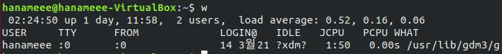

1.00 이라는 수치는 single-CPU 시스템이 평균적으로 100% utilized 되었다는 것, 1.00 이상의 수치는 시스템이 over-utilized 되었다는 것.

만약 CPU가 하나 이상이라면? Load average를 CPU의 갯수로 나눠보면 됨. 쿼드코어인 컴퓨터의 Load average가 4.00이라면, 4.00/4 = 평균적으로 100%가 n분 동안 utilized 되었다는 의미!

[MAC에서 CPU 갯수 확인하기]

```bash
# cpu 관련 정보 몽땅 가져오기
sysctl -a | grep cpu
# 코어 개수
sysctl machdep.cpu.core_count
# 스레드 개수 (하이퍼쓰레딩 기술 적용 중으로 코어 개수의 2배)
sysctl machdep.cpu.thread_count
```

### Background and Foreground Processes

리눅스는 background, foreground job 프로세싱을 지원한다. 여기서 job이란 터미널 윈도우에서 launch된 커맨드를 의미함!

Foreground job은 쉘에서 바로 실행되고, foreground job이 실행되는 동안은 이 job이 완료될때까지 다른 작업들은 shell access를 기다려야 한다. 빨리 끝나는 작업이라면 몰라도 오래 걸리는 작업이라면 성능에 불리할 수 있음.

이럴 경우, job을 background에서 실행하고, shell을 다른 작업들을 위해 free 할 수 있다. background job은 더 낮은 우선순위로 실행될 것이고, background job이 실행되는 와중에도 다른 job들이 스무스하게 실행될 수 있음.

모든 작업은 기본적으로 foreground에서 실행되나, 커맨드의 마지막에 `&` 를 입력해서 backgound에서 실행할 수 있다. (e.g. `updatedb &`)

foreground job을 정지하기 위해서는 `CTRL-Z`를, 취소하기 위해서는 `CTRL-C`를 사용하고, `bg`, `fg` 명령어를 통해 프로세스를 각각 background, foreground에서 실행할 수 있다.

#### 실습해보기

우분투 환경에서 background, foreground jobs를 실습해보자😀

1) 텍스트 편집기인 `gedit` 을 연다

```bash
gedit somefile
```

이렇게 하면 gedit이 **foreground에서 실행**된다. 터미널 윈도우에 뭔가 입력을 할 수는 있지만, input이 처리되지는 않는다. (shell doesn't pay attention to input)

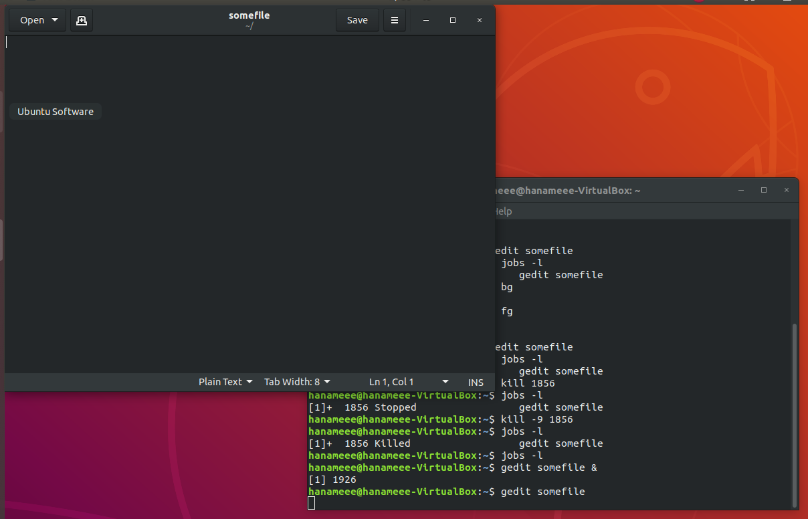

2) 터미널로 가서, `ctrl-z` 로 foreground job (gedit)을 정지한다. 이제 gedit는 정지되었기 때문에 더이상 input을 입력할 수 없다.

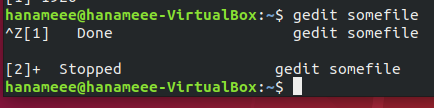

`jobs -l`을 통해 gedit이 정지된 것을 확인할 수 있다.

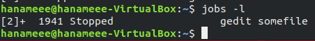

3) 가장 최근 job을 background로 실행한다.

```bash
bg
```

가장 최근 job이 gedit이기 때문에, 정지되었던 gedit이 background로 실행되어 입력 가능해진 것을 확인할 수 있다.

또한, background로 실행되었으므로 shell에도 명령어 입력이 가능하다.

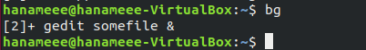

4) 가장 최근 job (gedit)을 foreground로 실행한다.

```bash
fg
```

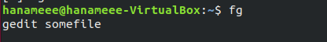

다시 처음 상태와 같이, 터미널 윈도우에는 명령을 내리지 못하고, gedit만 작동하는 상황이 된다.

5) 다시 gedit을 정지하고, (ctrl-z) `jobs -l` 로 gedit의 PID를 확인한 후 kill한다.

```bash
kill -9 [PID]
```

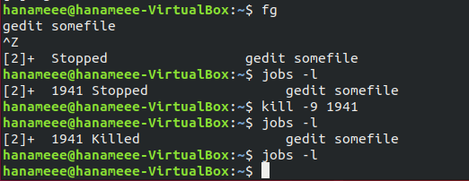

### Managing Jobs

`jobs` 유틸리티는 background에서 실행중인 모든 jobs를 보여준다.

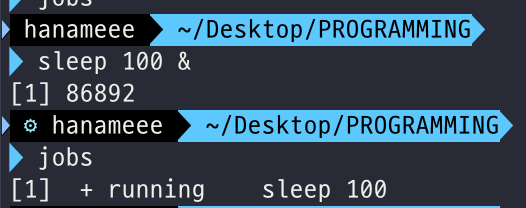

위 사진처럼 job ID, state, command name을 보여준다.

```bash
jobs -l
```

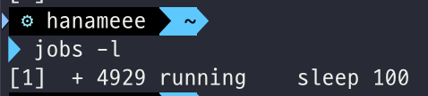

`-l` 플래그를 붙이면 background jobs에 PID 정보까지 더해서 보여준다. 

background jobs는 terminal window에 연결되어 있어서, 로그 오프를 하면 해당 윈도우에서 시작한 background jobs는 더 이상  `jobs` 유틸리티에서 보여지지 않게 된다.

##Listing Processes: ps and top

### The ps Command (System V Style)

`ps` 명령어는 PID로 구분된, 현재 실행되고 있는 프로세스들에 대한 정보를 제공한다.

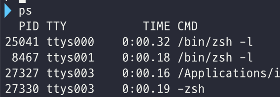

프로세스 정보들에 대한 반복적인 업데이트를 받으려면 아래와 같은  `top`  명령어나

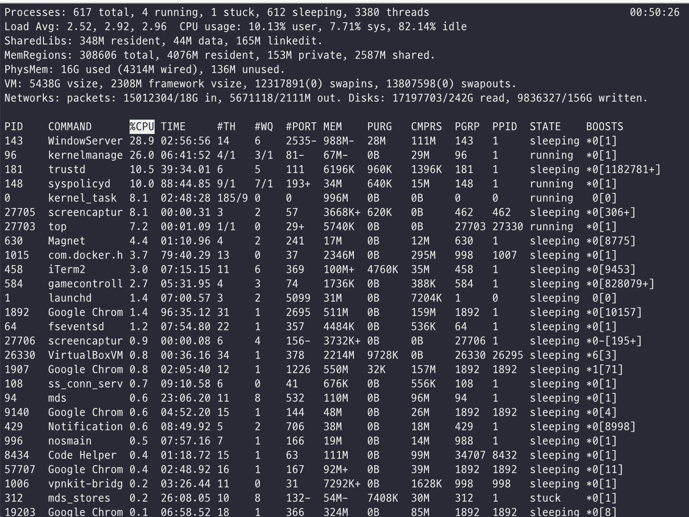

`htop`, `atop` 등의 variants를 설치해서 사용하면 된다. 또는 운영체제 배포판에서 제공하는 graphical system monitor 앱을 사용해도 된다.

`ps` 에 여러 옵션을 넘길 수 있는데,

- 어떤 task를 검사할건지
- 어떤 정보를 보여줄건지
- output이 어떤 포맷으로 보이게끔 할지

만약 옵션이 주어지지 않으면, `ps` 는 기본적으로 현재 shell에서 실행되는 모든 프로세스를 보여준다.

`-u` 옵션으로는 특정 username에 할당된 프로세스 정보를 보여준다.

`-ef` 옵션으로는 시스템에 있는 모든 프로세스를 full detail로 보여준다. `eLf` 는 한단계 더 나아가서 모든 thread에 대한 정보를 한줄씩 보여준다.

### The ps Command (BSD Style)

`ps` 는 UNIX의 BSD variety로부터 유래된 다른 스타일의 옵션들도 있는데, 위의 `System V` 스타일과는 달리 대시 (`-`) 없이 옵션을 명시할 수 있다.

- `ps aux` : 모든 user에 대한 프로세스를 보여준다
- `ps axo` : 어떤 속성을 보고 싶은지 명시할 수 있다 (e.g. ps axo stat,priority,pid,pcpu,comm)

### The Process Tree

`pstree` 명령어로 현재 시스템에서 실행중인 프로세스들의 목록을 트리 형식으로 볼 수 있다. 트리 형식이기에 부모 프로세스와, 자식 프로세스 같은 프로세스 간의 관계를 파악할 수 있다.

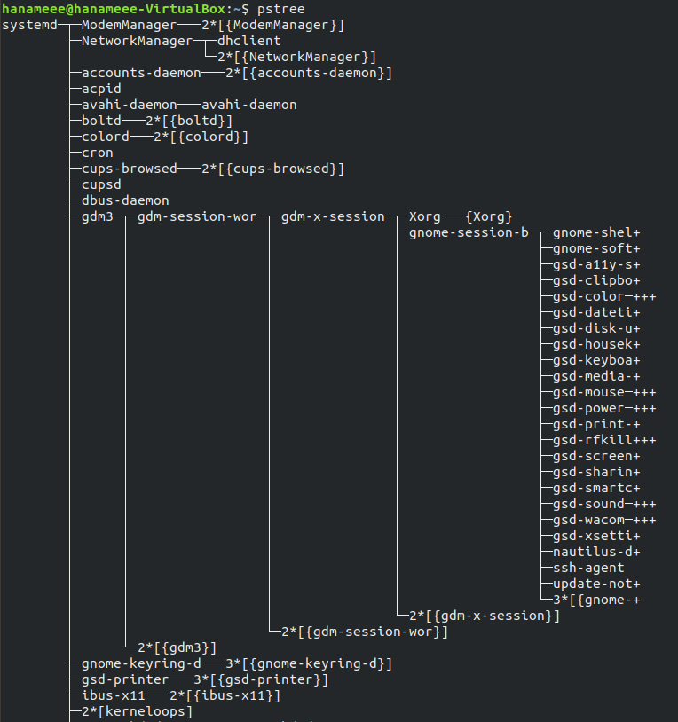

tread는 중괄호 `{}` 로 표시되고, 프로세스의 반복된 entries는 표시되지 않는다.

### top

시스템의 정적인 상태를 파악하는 것도 유용하지만, 시간에 따라 시스템의 성능을 모니터링하려면 `top` 명령어가 유용하다.

`top` 은 default로 2초에 한번씩 실시간으로 업데이트를 하면서 시스템의 상태를 보여준다. top은 가장 많은 CPU 사이클과 메모리를 소비하는 프로세스들을 강조해서 보여줄 수도 있다 :D

#### top 정보 분석

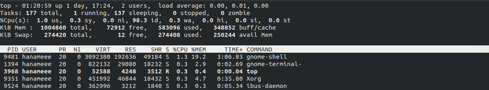

#### 첫번째 줄

`top` 의 첫번째 줄은 아래와 같은 정보를 보여준다.

- System uptime
- 시스템에 로그인되어 있는 유저의 수
- load average: 시스템이 얼마나 바쁜지 나타내는 지표. `1.00` 은 하나의 CPU가 완전히 subscribed 되어 있음을 의미함.

#### 두번째 줄

`top` 의 두번째 줄은 아래와 같은 정보를 보여준다.

- 프로세스의 전체 갯수
- running, sleeping, stopped, zombie 프로세스의 갯수

Load average와 running 프로세스의 갯수를 비교해보면 시스템이 capacity에 도달했는지, 혹은 특정 유저가 너무 많은 프로세스를 실행중인지를 판단할 수 있다.

#### 세번째 줄

`top` 의 세번째 줄은 아래와 같은 정보를 보여준다.

- CPU time이 user(us)과 kernel(sy)간에 어떻게 나눠지고 있는지 %로 보여줌
- ni: 낮은 우선순위로 실행되고 있는 user jobs의 비율 (niceness)
- id: idle mode (load average가 높다면 id가 낮아야 함)
- wa: I/O 대기중인 jobs의 비율
- hi: 하드웨어 interrupt
- si: 소프트웨어 interrupt
- st: steal time - idle CPU time을 다른 uses를 위해 남겨두는 vm에서 주로 사용됨

#### 네번째, 다섯번째 줄

`top` 의 네번째, 다섯번째 줄은 아래와 같은 정보를 보여준다.

- 4번째 줄: 물리 메모리 (RAM)의 usage
- 5번쨰 줄: Swap 공간의 usage

4,5번째줄 모두 total memory, used memory, free space에 대한 정보를 보여준다.

좋은 시스템 성능을 위해서는 메모리 사용량을 모니터링 하는게 중요하다!_!

물리 메모리가 다 사용되면, 시스템은 확장된 메모리 공간으로 swap space(하드드라이브에 있는 임시 저장 공간)를 사용한다. 디스크에 접근하는건 RAM보다 훨씬 느리므로 시스템 성능에 악영향을 준다.

시스템이 swap 공간을 자주 사용한다면, swap 공간을 더 추가할 수는 있다. 하지만 가급적 물리 메모리를 추가하는 것이 더 좋은 방법으로 고려되어야..!

#### 프로세스 목록

프로세스에 대한 정보를 보여주는 부분은 기본적으로 CPU 사용량이 많은 프로세스 순서로 보여지고, 아래와 같은 정보들을 볼 수 있다.

- Process Identification Number (PID)
- Process owner (USER)
- Priority (PR) and nice values (NI)
- Virtual (VIRT), physical (RES), and shared memory (SHR)
- Status (S)
- Percentage of CPU (CPU) and memory (MEM) used
- Execution time (TIME+)
- Command (COMMAND).

### Interactive Keys with top

`top` 은 정보를 리포팅하는 것 외에도, 프로세스 모니터링 + 컨트롤링을 위해 interactive하게 사용될 수 있다.

`top` 이 터미널에서 정보를 보여주는 동안, 한글자짜리 커맨드를 입력해서 top의 behavior을 변경할 수 있다.

CPU 사용량, 메모리 사용량이 가장 높은 프로세스를 보여주게 하거나, 현재 실행중인 프로세스의 우선순위를 변경하거나, 프로세스를 정지/kill하는 것도 가능하다.

 

| **Command** | **Output**                                                |
| ----------- | --------------------------------------------------------- |
| t           | Display or hide summary information (rows 2 and 3)        |
| m           | Display or hide memory information (rows 4 and 5)         |
| A           | Sort the process list by top resource consumers           |
| r           | Renice (change the priority of) a specific processes      |
| k           | Kill a specific process                                   |
| f           | Enter the top configuration screen                        |
| o           | Interactively select a new sort order in the process list |

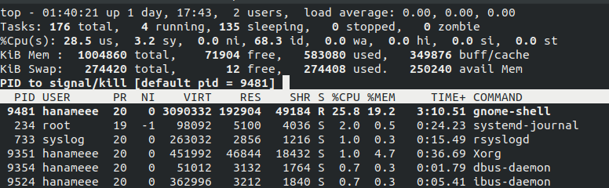

예를 들어 `k` 를 입력하면 위 사진처럼 kill할 프로세스의 pid를 입력하라는 프롬프트가 뜬다.