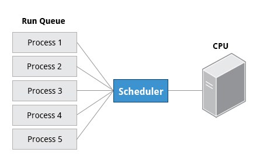

# Ch9 - Processes

## Introduction and Learning Objectives

👩🏻‍🏫 **Learning Objectives**

- Describe what a process is and distinguish between types of processes.
- Enumerate process attributes.
- Manage processes using **ps** and **top**
- Understand the use of load averages and other process metrics.
- Manipulate processes by putting them in background and restoring them to foreground.
- Use **at**, **cron**, and **sleep** to schedule processes in the future or pause them.

## Introduction to Processes and Process Attributes

### Process란?

> A **process** is simply an instance of one or more related tasks (threads) executing on your computer.

프로세스는 메모리, CPU 사이클, 주변 장치 (네트워크 카드, 하드드라이브, 프린터, 디스플레이 등)와 같은 시스템 리소스를 사용한다.

OS(특히 커널)는 각 프로세스에 알맞게 리소스를 분배하는 역할을 하고, 전체적인 시스템 활용 최적화를 보증한다.

### Process Types

커맨드 쉘의 일종인 터미널은 필요한 만큼 실행되는 프로세스다. 쉘에서 detached 되어 background에서 수행되는 프로그램들도 있다.

프로세스들은 수행되는 일들에 따라 각기 다른 종류로 나뉜다.

| **Process Type**      | **Description**                                              | **Example**                        |
| --------------------- | ------------------------------------------------------------ | ---------------------------------- |
| Interactive Processes | 유저에 의해 시작 (커맨드 라인이나 gui 등) 되어야 하는 프로세스. | **bash, firefox, top**             |
| Batch Processes       | Automatic processes which are scheduled from and then disconnected from the terminal. These tasks are queued and work on a **FIFO** (First-In, First-Out) basis. | **updatedb, ldconfig**             |
| Daemons               | 지속적인 서비스 요청을 처리하기 위해 백그라운드에서 계속 실행되는 프로세스. 보통 프로세스 뒤에 `d`가 붙어있다. Many are launched during system startup and then wait for a user or system request indicating that their service is required. | **httpd, sshd, libvirtd**          |
| Threads               | **Lightweight processes**. These are tasks that run under the umbrella of a main process, sharing memory and other resources, but are scheduled and run by the system on an individual basis. An individual thread can end without terminating the whole process and a process can create new threads at any time. Many non-trivial programs are multi-threaded. | **firefox, gnome-terminal-server** |
| Kernel Threads        | Kernel tasks that users neither start nor terminate and have little control over. These may perform actions like moving a thread from one CPU to another, or making sure input/output operations to disk are completed. | **kthreadd, migration, ksoftirqd** |

### Process Scheduling and States

**스케줄러**라는 중요한 커널 기능은 끊임없이 CPU에 프로세스를 shift 한다. (적재했다가, 빼고, 적재했다가, 빼고...) 이 프로세스들은 상대 우선순위(얼마의 시간이 필요한지, 얼마의 시간이 이미 할당되었었는지...)에 따라 time sharing을 한다. 

#### Running

프로세스가 Running 상태라는 것은 - 현재 CPU에서 instruction을 실행하고 있는 중이거나 / 실행을 위해 time slice를 할당받아 기다리고 있는 상태라는 것.

Running 상태의 프로세스들은 컴퓨터 코어(CPU) 내에 존재하는 **Run queue**에 위치한다. 멀티코어(CPU) 컴퓨터는 각각의 코어에 Run queue를 가지고 있음.



#### Sleep

Sleep 상태의 프로세스들은 일반적으로 재개되기 위해 무언가를 (e.g. 사용자의 입력) 기다리는 상태이다. 이 상태에서 프로세스는 **Wait queue**에 위치한다.

#### 그 외

그 외 덜 흔한 프로세스의 상태로는, 프로세스가 Terminating 할 때의 상태, 자식 process는 완료되었지만 부모 process가 이를 알지 못해 프로세스가 살아있진 않으나 시스템의 process list에서는 보이는 zombie 상태 등등이 있다.

### Process and Thread IDs

어느 시점이든지, 여러 프로세스들이 실행되고 있다. OS는 이 각각의 프로세스를 유니크한 PID (Process ID)로 식별한다. PID를 이용해 process의 상태와, cpu/메모리 사용량, 리소스가 메모리에 위치한 장소 등등의 특징들을 추적한다.

새로운 PID는 프로세스가 탄생했을때 오름차순으로 새롭게 할당된다. 따라서 **PID 1은 init process를 의미**한다. init 프로세스 이후에 탄생한 프로세스들은 더 높은 숫자들을 할당받게 됨.

[PID의 종류]

| ID Type                  | Description                                                  |
| ------------------------ | ------------------------------------------------------------ |
| Process ID (PID)         | Unique Process ID number                                     |
| Parent Process ID (PPID) | 이 프로세스를 시작한 Parent Process의 ID. 만약 Parent Process가 죽으면, PPID는 adoptive parent를 가르키게 된다. on recent kernels, this is kthreadd which has PPID=2. |
| Thread ID (TID)          | Thread ID number. 싱글쓰레드 프로세스에서는 PID와 같다. 멀티쓰레드 프로세스에서는 각 쓰레드는 같은 PID를 공유하지만 TID는 각각 unique 하다. |

### Terminating a Process

프로세스를 종료하는 법은 아래와 같다.

```shell
kill -SIGKILL <pid>
# 또는
kill -9 <pid>
```

명심해야 할 것은 항상 내 process만 kill 할 수 있다는 것! Root 유저가 아닌 이상, 다른 유저에 속하는 process는 kill 할 수 없다.

### User and Group IDs

많은 유저들이 한 시스템에 동시다발적으로 접근할 수 있고, 각 유저가 여러 프로세스를 실행할 수 있다.

OS는 어떤 유저가 어떤 프로세스를 시작했는지를 각 유저에 부여된 RUID (Real User ID)로 식별한다.  접근 권한을 판단할 때는 EUID (Effective User ID)를 따른다. EUID는 RUID와 같을 수도, 다를 수도 있다.

유저들은 또 여러 그룹으로 카테고리 지어질 수 있는데, 각 그룹은 RGID (Real Group ID) 로 식별되고, 각 그룹의 접근 권한은 EGID로 식별된다. 각 유저는 하나 이상의 그룹의 멤버일 수 있다.


하지만 대부분의 경우 디테일은 생략하고 UID, GID로 얘기할 것!

### More About Priorities

항상 여러 프로세스들이 running 상태에 있긴 하지만, CPU가 한 시점에 처리할 수 있는 프로세스는 오직 하나다. 따라서 프로세스들은 우선순위에 따라 CPU를 선취할 수 있는 권한을 갖는데, 리눅스는 유저가 이런 프로세스의 우선순위를 지정/조작 할 수 있게 해 두었다.

프로세스의 우선순위는 **nice value** 또는 niceness를 명시함으로써 설정할 수 있다. nice value가 낮을수록 (최하 -20) 우선순위가 높고, 높을 수록 (최대 +19) 우선순위가 낮다.

또한, time-sensitive한 작업에는 **real-time priority**를 할당할 수 있는데, 이건 아주 높은 우선순위를 의미한다. 