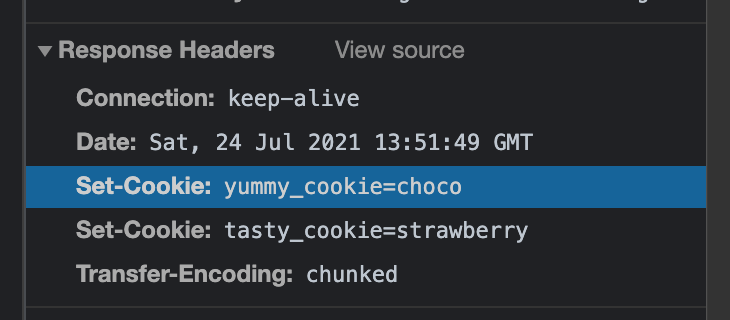
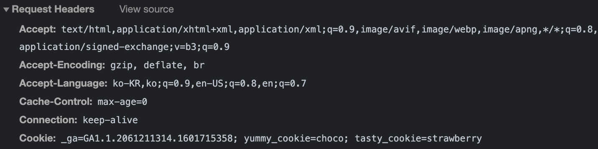
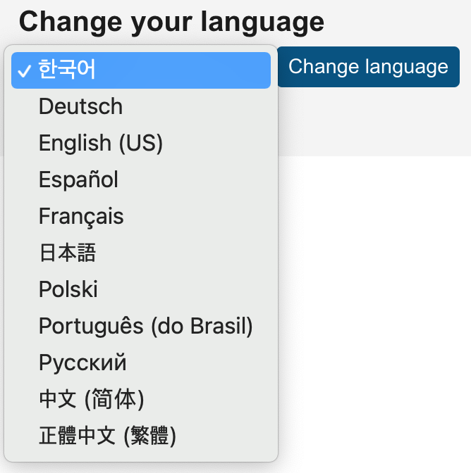
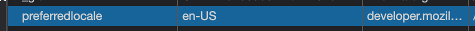

# 쿠키와 인증

수업 링크: https://opentutorials.org/course/3387/21740

## HTTP 쿠키

### 정의

쿠키는 stateless HTTP 프로토콜에서 상태정보를 기억하기 위해 사용하는 수단 중 하나로, **서버가 사용자의 웹 브라우저에 전송하는 작은 데이터 조각**이다. 브라우저는 쿠키를 저장해 놓았다가, 동일한 서버에 재 요청 시 쿠키를 함께 전송한다. 쿠키를 사용하면 서버는 두 요청이 동일한 브라우저에서 들어왔는지를 판단할 수 있다.

### 쿠키의 목적

1) 세션 관리: 서버에 저장해야 할 로그인, 장바구니 등의 정보 관리

2) 개인화: 사용자 preference, 테마 등의 세팅

3) 트래킹: 사용자 행동을 기록하고 분석하는 용도

출처: https://developer.mozilla.org/ko/docs/Web/HTTP/Cookies

### 쿠키 생성하기

서버가 응답할 때 `Set-Cookie` 헤더를 전송함으로써 쿠키를 만들 수 있다.

> 웹서버 생성, 쿠키 생성 예시 코드

```javascript
const http = require("http");
http.createServer((req, res) => {
    res.writeHead(200, {
        "Set-Cookie": ["yummy_cookie=choco", "tasty_cookie=strawberry"],
    });
    res.end("cookie!");
}).listen(3000);
```

복수의 쿠키를 생성할 때는 위와 같이 배열로 선언하면 된다.

웹서버에서 응답할 때 쿠키를 구워서 보내고,



이후부터는 브라우저에서 요청 코드에 구워진 쿠키를 함께 전송하는 것을 알 수 있다.



### 쿠키 읽기

브라우저에서 응답에 함께 전송한 쿠키를 웹서버에서는 어떻게 받을까?

쿠키는 `request.headers.cookies` 에 들어있는데, 쿠키의 형태가 `yummy_cookie=choco; tasty_cookie=strawberry` 이런 string으로 주어지므로 parsing (deserialization)이 필요하다. 우리는 객체화된 쿠키가 필요하므로!

이 작업을 직접 해도 되지만... 이걸 해주는 [cookie](https://www.npmjs.com/package/cookie) 모듈을 활용하자 :D

### 쿠키의 활용

쿠키를 활용하는 실 사례를 좀 더 확인해보자!

[Mozilla](https://developer.mozilla.org/)에서는 언어 옵션을 바꿀 수 있는데, 이 기능에서 개인화를 위해 쿠키를 사용한다.



위처럼 선호 언어를 변경하고 개발자도구의 Application 창을 열어보면, 아래와 같이 쿠키가 저장된 것을 알 수 있는데,



이 상태에서 [Mozilla](https://developer.mozilla.org/)에 접속해보면 자동으로 뒤에 쿠키 value와 일치하는 `/ko` , `/en-US` 등의 locale 값이 붙는다. 

### Session 쿠키 vs. Permanent 쿠키

쿠키의 라이프타임은 2가지 방법으로 정의된다.

- Session Cookie: 현재 세션이 끝날 때 삭제되는 쿠키. 일반적으로는 브라우저가 꺼질때 세션이 종료되므로, Session Cookie는 브라우저를 껐다가 다시 켜면 삭제되어 있다.
- Permanent Cookie: `Expires` 속성에 명시된 날짜에 삭제되거나, `Max-Age` 속성에 명시된 기간 후에 삭제된다.

Permanent 쿠키를 만들어보자! `Expires` 또는 `Max-Age` 속성을 정의해주면 된다.

```javascript
res.writeHead(200, {
  "Set-Cookie": [
    "yummy_cookie=choco",
    "tasty_cookie=strawberry",
    `pernament_cookie=yoyo; Max-Age=${60 * 60 * 24 * 1}`,
  ],
});
```

브라우저를 종료한 뒤 재시작하면, `permanent_cookie` 를 제외한 쿠키들은 다 삭제되어 있음을 알 수 있다.

### 쿠키 옵션 - Secure & HttpOnly

보안 관련 옵션인 Secure과 HttpOnly를 알아보자!

#### Secure

Secure은 웹 브라우저와 웹 서버가 Https를 통해 통신할 경우에만 쿠키를 전송한다는 의미이다.

```javascript
res.writeHead(200, {
  "Set-Cookie": [
    "yummy_cookie=choco",
    "tasty_cookie=strawberry",
    "secure_cookie=secure; Secure", // 이 쿠키는 https로 통신할 때에만 브라우저가 서버에게 쿠키를 전송한다.
  ],
});
```

이런 옵션이 필요한 이유는, 세션 ID만 있으면 이를 갈취해서 마치 나인 것처럼 로그인을 하는 보안 이슈가 있을 수 있기 때문! 따라서 암호화된 통신인 https일 경우에만 브라우저에서 서버로 쿠키를 전송하도록 하는 것.

#### HttpOnly

웹 브라우저와 웹 서버가 통신할 때에만 쿠키를 전송하도록 하는 옵션이다.

```javascript
res.writeHead(200, {
  "Set-Cookie": [
    "yummy_cookie=choco",
    "tasty_cookie=strawberry",
    "http_cookie=http; HttpOnly", // 이 쿠키는 웹 브라우저 - 웹 서버 간의 통신에서만 전송된다. Javascript의 document.cookie로는 접근이 불가능하다.
  ],
});
```

HttpOnly 쿠키는 웹 브라우저에서 웹 서버로 전송되기만 할 뿐, Javascript의 document.cookie로는 얻을 수 없다. 브라우저의 콘솔에서 출력해보면 실제로 보이지 않는 것을 알 수 있다.

Cross-site 스크립팅 ([XSS (en-US)](https://developer.mozilla.org/en-US/docs/Glossary/Cross-site_scripting)) 공격을 방지하기 위한 옵션이다. 대표적으로 서버 쪽에서 지속되어 Javascript를 사용할 필요가 없는 세션 쿠키에서 `HttpOnly` 플래그가 설정된다. 

### 쿠키 옵션 - path & domain

`Domain` 그리고 `Path` 디렉티브는 **쿠키의 스코프**를 정의한다. 특정 도메인/Path 에서만 쿠키가 살아있게 하고 싶을 때 사용한다.

#### domain

```javascript
res.writeHead(200, {
  "Set-Cookie": [
    "yummy_cookie=choco",
    "tasty_cookie=strawberry",
    `domain_cookie=yoyo; Domain=o2.org`, // 이 쿠키는 o2.org와 *.o2.org 등의 모든 서브도메인에서 웹서버로 전송된다.
  ],
});
```

#### path

```javascript
res.writeHead(200, {
  "Set-Cookie": [
    "yummy_cookie=choco",
    "tasty_cookie=strawberry",
    `path_cookie=yoyo; Path=/cookie`, // 이 쿠키는 /cookie와 그 하위 디렉토리에서만 웹서버로 전송된다.
  ],
});
```

